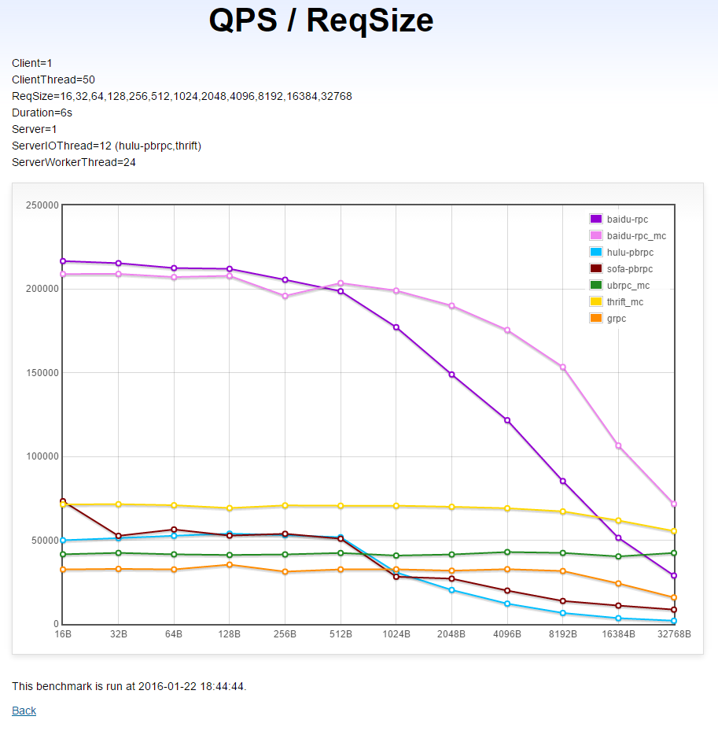
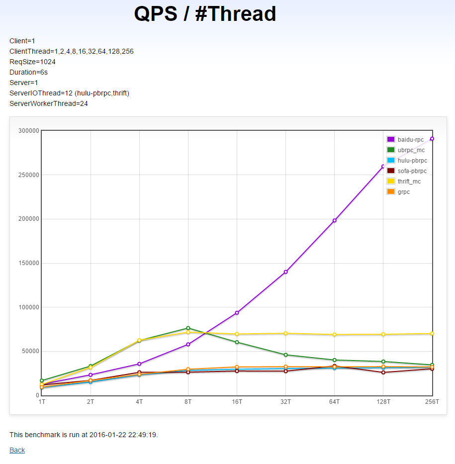
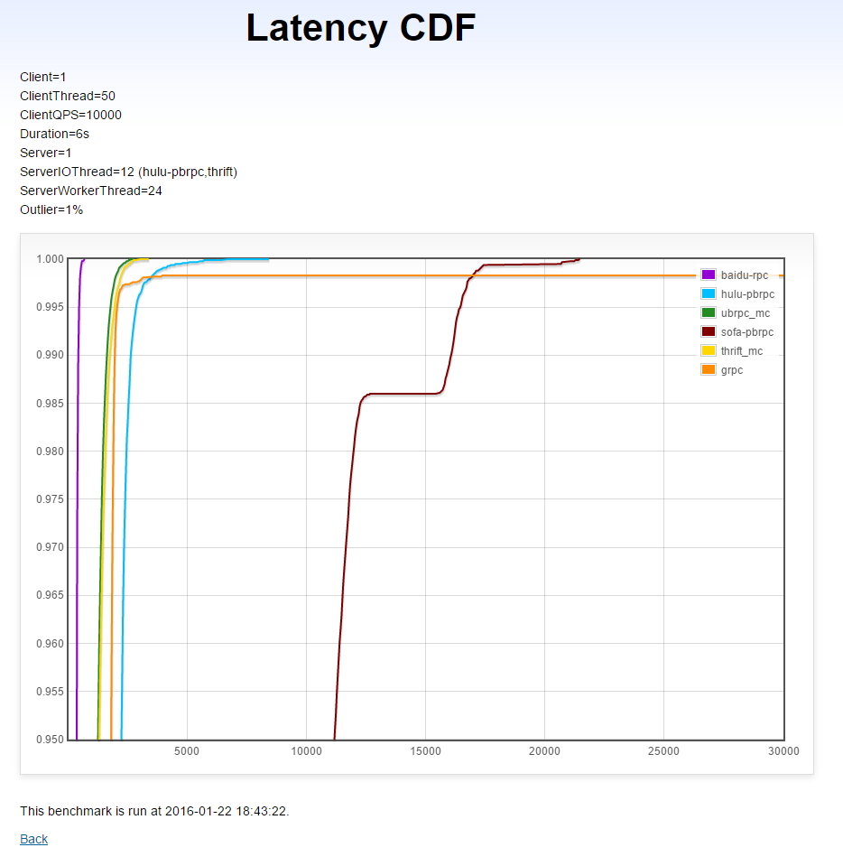
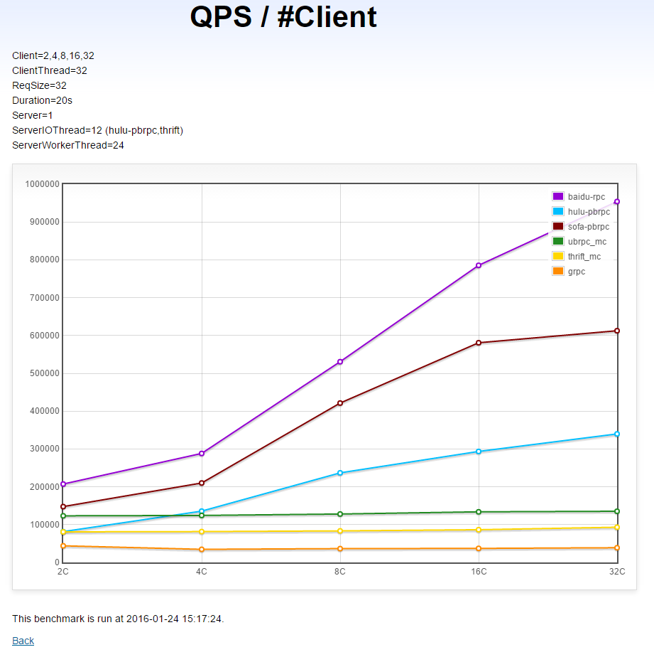
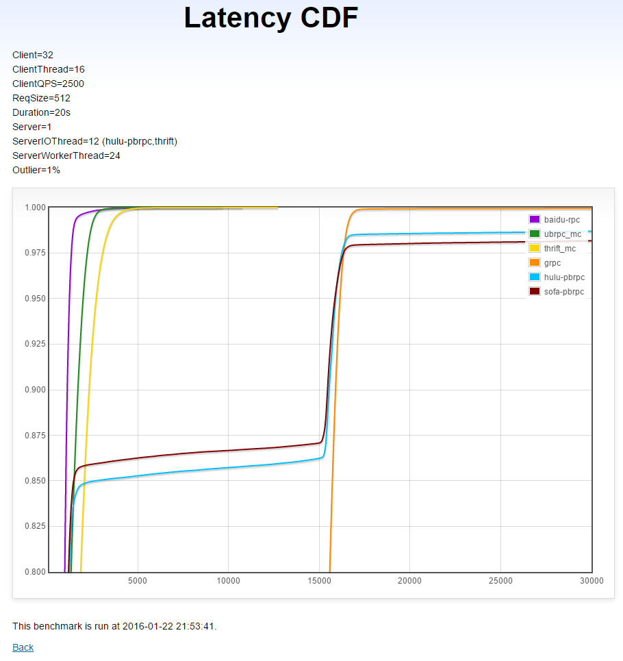
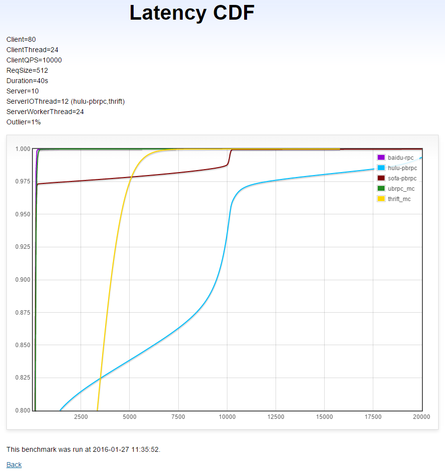
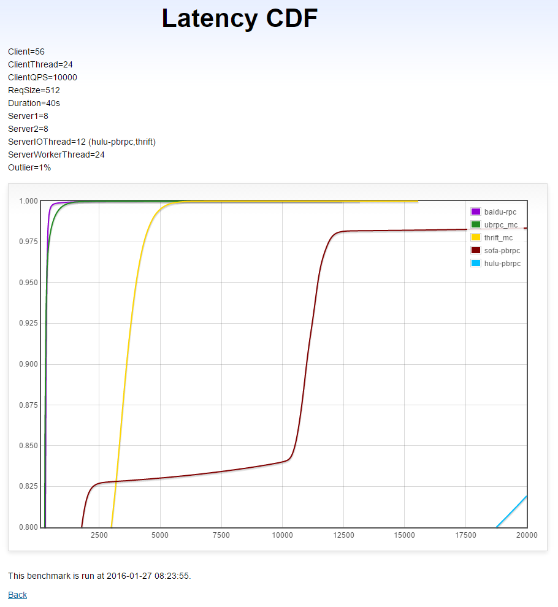

# 序言

在多核的前提下，性能和线程是紧密联系在一起的。线程间的跳转对高频IO操作的性能有决定性作用：一次跳转意味着至少3-20微秒的延时，由于每个核心的L1 cache独立（我们的cpu L2 cache也是独立的），随之而来是大量的cache miss，一些变量的读取、写入延时会从纳秒级上升几百倍至微秒级：等待cpu把对应的cacheline同步过来。有时这带来了一个出乎意料的结果，当每次的处理都很简短时，一个多线程程序未必比一个单线程程序更快。因为前者可能在每次付出了大的切换代价后只做了一点点“正事”，而后者在不停地做“正事”。不过单线程也是有代价的，它工作良好的前提是“正事”都很快，否则一旦某次变慢就使后续的所有“正事”都被延迟了。在一些处理时间普遍较短的程序中，使用（多个不相交的）单线程能最大程度地”做正事“，由于每个请求的处理时间确定，延时表现也很稳定，各种http server正是这样。但我们的检索服务要做的事情可就复杂多了，有大量的后端服务需要访问，广泛存在的长尾请求使每次处理的时间无法确定，排序策略也越来越复杂。如果还是使用（多个不相交的）单线程的话，一次难以预计的性能抖动，或是一个大请求可能导致后续一堆请求被延迟。

为了避免请求之间相互影响，请求级的线程跳转是baidu-rpc必须付出的代价，我们能做的是使[线程跳转最优化](io.md#the-full-picture)。不过，对服务的性能测试还不能很好地体现这点。测试中的处理往往极为简单，使得线程切换的影响空前巨大，通过控制多线程和单线程处理的比例，我们可以把一个测试服务的qps从100万到500万操纵自如（同机），这损伤了性能测试结果的可信度。要知道，真实的服务并不是在累加一个数字，或者echo一个字符串，一个qps几百万的echo程序没有指导意义。鉴于此，在发起性能测试一年后（15年底），在baidu-rpc又经历了1200多次改动后，我们需要review所有的测试，加强其中的线程因素，以获得对真实场景有明确意义的结果。具体来说：

- 请求不应等长，要有长尾。这能考察RPC能否让请求并发，否则一个慢请求会影响大量后续请求。
- 要有多级server的场景。server内用client访问下游server，这能考察server和client的综合表现。
- 要有一个client访问多个server的场景。这能考察负载均衡是否足够并发，真实场景中很少一个client只访问一个server。

我们希望这套测试场景对其他服务的性能测试有借鉴意义。

# 测试目标

## UB

com组（INF前身）在08年开发的RPC框架，目前仍在百度广泛使用，已被baidu-rpc代替。UB本身不支持protobuf，因此我们以基于UB的nova pb-rpc为代表，这个框架在网盟广泛使用。测试时其代码为：<https://svn.baidu.com/app/ecom/cm/trunk/pb-rpc>（r10500）。早期的UB支持CPOOL和XPOOL，分别使用[select](http://linux.die.net/man/2/select)和[leader-follower模型](http://kircher-schwanninger.de/michael/publications/lf.pdf)，后来提供了EPOOL，使用[epoll](http://man7.org/linux/man-pages/man7/epoll.7.html)处理多路连接。鉴于产品线大都是用EPOOL模型，我们的UB配置也使用EPOOL。UB只支持[连接池](client.md#连接方式)，结果用“**ubrpc_mc**"指代（mc代表"multiple
connection"）。虽然这个名称不太准确（ubrpc是INF在10年使用UB和idlcompiler开发的一个框架），但在本文的语境下，请默认ubrpc = UB。

## hulu-pbrpc

INF在2013年开发的pbrpc产品，目前被baidu-rpc代替，测试时其代码为：<https://svn.baidu.com/public/tags/hulu/pbrpc/pbrpc_2-0-15-27959_PD_BL>。hulu-pbrpc只支持单连接，结果用“**hulu-pbrpc**"指代。

## baidu-rpc

INF在2014年底开发至今的rpc产品，支持百度内所有协议（不限于protobuf），测试时其代码为：<https://svn.baidu.com/public/tags/baidu-rpc/baidu-rpc_1-0-199-31906_PD_BL>
（开发请使用@ci-base保持更新）。baidu-rpc既支持单连接也支持连接池，前者的结果用"**baidu-rpc**"指代，后者用“**baidu-rpc_mc**"指代。

## sofa-pbrpc

PS内部广泛使用的pbrpc产品，在public/sofa-pbrpc和github.com上还有两个sofa-pbrpc版本，咨询sofa-pbrpc的同学后，确认ps/opensource下的和github上的较新，且会定期同步。故测试使用使用ps/opensource下的版本。测试时其代码为：<https://svn.baidu.com/ps/opensource/branches/sofa-pbrpc/sofa-pbrpc_1-0-2_BRANCH/>。sofa-pbrpc只支持单连接，结果用“**sofa-pbrpc**”指代。

## apache thrift

thrift是由fb开发的序列化方法和rpc框架，开源后改名apache thrift，fb自己有一个[fbthrift分支](https://github.com/facebook/fbthrift)，我们使用的是apache thrift。测试时其代码为：<https://svn.baidu.com/third-64/tags/thrift/thrift_0-9-1-400_PD_BL/>。thrift没有线程安全的client，所以每个线程中都得建立一个client，使用独立的连接。在测试中thrift其实是占了其他实现的便宜：它的client不需要处理多线程问题。但在真实环境中，thrift的client不方便。thrift的结果用"**thrift_mc**"指代。

## grpc

由google开发的rpc框架，使用http/2和protobuf 3.0，测试时其代码为：<https://github.com/grpc/grpc/tree/release-0_11>。grpc并不是stubby，定位更像是为了推广http/2和protobuf 3.0，但鉴于很多人对它的表现很感兴趣，我们也（很麻烦地）把它加了进来。grpc的结果用"**grpc**"指代。

# 测试方法

如序言中解释的那样，性能数字有巨大的调整空间。这里的关键在于，我们对RPC的底线要求是什么，脱离了这个底线，测试中的表现就严重偏离真实环境中的了。

这个底线我们认为是**RPC必须能处理长尾**。

在百度的环境中，这是句大白话，哪个产品线，哪个系统没有长尾呢？作为承载大部分服务的RPC框架自然得处理好长尾，减少长尾对正常请求的影响。但在实现层面，这个问题对设计的影响太大了。如果测试中没有长尾，那么RPC实现就可以假设每个请求都差不多快，这时候最优的方法是用多个线程独立地处理请求。由于没有上下文切换和cache一致性同步，程序的性能会显著高于多个线程协作时的表现。

比如简单的echo程序，处理一个请求只需要200-300纳秒，单个线程可以达到300-500万的吞吐。但如果多个线程协作，即使在及其流畅的系统中，也要付出3-5微秒的上下文切换代价和1微秒的cache同步代价，这还没有考虑多个线程间的其他互斥逻辑，一般来说单个线程的吞吐很难超过10万，即使24核全部用满，吞吐也只有240万，不及一个线程。这正是以http server为典型的服务选用[单线程模型](threading_overview.md#单线程reactor)的原因（多个线程独立运行eventloop）：大部分http请求的处理时间是可预测的，对下游的访问也不会有任何阻塞代码。这个模型可以最大化cpu利用率，同时提供可接受的延时。

多线程付出这么大的代价是为了**隔离请求间的影响**。一个计算复杂或索性阻塞的过程不会影响到其他请求，1%的长尾最终只会影响到1%的性能。而多个独立的线程是保证不了这点的，一个请求进入了一个线程就等于“定了终生”，如果前面的请求慢了一下，那也只能跟着慢了。1%的长尾会影响远超1%的请求，最终表现不佳。换句话说，乍看上去多线程模型“慢”了，但在真实应用中反而会获得更好的综合性能。

延时能精确地体现出长尾的干扰作用，如果普通请求的延时没有被长尾请求干扰，就说明RPC成功地隔离了请求。而QPS无法体现这点，只要CPU都在忙，即使一个正常请求进入了挤满长尾的队列而被严重延迟，最终的QPS也变化不大。为了测量长尾的干扰作用，我们在涉及到延时的测试中都增加了1%的长尾请求。

# 开始测试

## 环境

性能测试使用的机器配置为：

- 单机1：CPU开超线程24核，E5-2620 @ 2.00GHz；64GB内存；OS linux 2.6.32_1-15-0-0
- 多机1（15台+8台）：CPU均未开超线程12核，其中15台的CPU为E5-2420 @ 1.90GHz.，64GB内存，千兆网卡，无法开启多队列。其余8台为E5-2620 2.0GHz，千兆网卡，绑定多队列到前8个核。这些长期测试机器比较杂，跨了多个机房，测试中延时在1ms以上的就是这批机器。
- 多机2（30台）：CPU未开超线程12核，E5-2620 v3 @ 2.40GHz.；96GB内存；OS linux 2.6.32_1-17-0-0；万兆网卡，绑定多队列到前8个核。这是临时借用的新机器，配置非常好，都在广州机房，延时非常短，测试中延时在几百微秒的就是这批机器。

测试代码：<https://svn.baidu.com/com-test/trunk/public/rpc-perf/>

下面所有的曲线图是使用baidu-rpc开发的dashboard程序绘制的，去掉路径后可以看到和所有baidu-rpc
server一样的[内置服务](builtin_service.md)。

## 配置

如无特殊说明，所有测试中的配置只是数量差异（线程数，请求大小，client个数etc），而不是模型差异。我们确保用户看到的qps和延时是同一个场景的不同维度，而不是无法统一的两个场景。

所有RPC server都配置了24个工作线程，这些线程一般运行用户的处理逻辑。关于每种RPC的特殊说明：

- UB：配置了12个reactor线程，使用EPOOL模型。连接池限制数配置为线程个数（24）
- hulu-pbrpc: 额外配置了12个IO线程。这些线程会处理fd读取，请求解析等任务。hulu有个“共享队列“的配置项，默认不打开，作用是把fd静态散列到多个线程中，由于线程间不再争抢，hulu的qps会显著提高，但会明显地被长尾影响（原因见[测试方法](#测试方法)）。考虑到大部分使用者并不会去改配置，我们也选择不打开。
- thrift: 额外配置了12个IO线程。这些线程会处理fd读取，请求解析等任务。thrift的client不支持多线程，每个线程得使用独立的client，连接也都是分开的。
- sofa-pbrpc：按照sofa同学的要求，把io_service_pool_size配置为24，work_thread_num配置为1。大概含义是使用独立的24组线程池，每组1个worker thread。和hulu不打开“共享队列”时类似，这个配置会显著提高sofa-pbrpc的QPS，但同时使它失去了处理长尾的能力。如果你在真实产品中使用，我们不建议这个配置。（而应该用io_service_pool_size=1, work_thread_num=24)
- baidu-rpc：尽管baidu-rpc的client运行在bthread中时会获得10%~20%的QPS提升和更低的延时，但测试中的client都运行统一的pthread中。

所有的RPC client都以多个线程同步方式发送，这种方法最接近于真实系统中的情况，在考察QPS时也兼顾了延时因素。

一种流行的方案是client不停地往连接中写入数据看server表现，这个方法的弊端在于：server一下子能读出大量请求，不同RPC的比拼变成了“for循环执行用户代码”的比拼，而不是分发请求的效率。在真实系统中server很少能同时读到超过4个请求。这个方法也完全放弃了延时，client其实是让server陷入了雪崩时才会进入的状态，所有请求都因大量排队而超时了。

## 同机单client→单server在不同请求下的QPS（越高越好）

本测试运行在[单机1](#环境)上。图中的数值均为用户数据的字节数，实际的请求尺寸还要包括协议头，一般会增加40字节左右。

（X轴是用户数据的字节数，Y轴是对应的QPS）

**分析**
 * 以_mc结尾的曲线代表client和server保持多个连接（线程数个），在本测试中会有更好的表现。
 * baidu-rpc：当请求包小于16KB时，单连接下的吞吐超过了多连接的ubrpc_mc和thrift_mc，随着请求包变大，内核对单个连接的写入速度成为瓶颈。而多连接下的baidu-rpc则一骑绝尘，达到了测试中最高的2.3GB/s。注意：虽然使用连接池的baidu-rpc在发送大包时吞吐更高，但也会耗费更多的CPU（UB和thrift也是这样）。下图中的单连接baidu-rpc已经可以提供800多兆的吞吐，足以打满万兆网卡，而使用的CPU可能只有多链接下的1/2
 * （写出过程是[wait-free的](io.md#发消息)），真实系统中请优先使用单链接。
* thrift: 初期明显低于baidu-rpc，随着包变大超过了单连接的baidu-rpc。
* UB:
* 和thrift类似的曲线，但平均要低4-5万QPS，在32K包时超过了单连接的baidu-rpc。整个过程中QPS几乎没变过。
* grpc: 初期几乎与UB平行，但低1万左右，超过8K开始下降。
* hulu-pbrpc和sofa-pbrpc:
* 512字节前高于UB和grpc，但之后就急转直下，相继垫底。这个趋势是写不够并发的迹象。

## 同机单client→单server在不同线程数下的QPS（越高越好）

本测试运行在[单机1](#环境)上。

（X轴是线程数，Y轴是对应的QPS）

**分析**

baidu-rpc: 随着发送线程增加，QPS在快速增加，有很好的多线程扩展性。

UB和thrift：8个线程下高于baidu-rpc，但超过8个线程后被baidu-rpc迅速超过，thrift继续“平移”，UB出现了明显下降。

grpc，hulu-pbrpc，sofa-pbrpc: 几乎重合，256个线程时相比1个线程时只有1倍的提升，多线程扩展性不佳。

## 同机单client→单server在固定QPS下的延时[CDF](vars.md#统计和查看分位值)（越左越好，越直越好）
本测试运行在[单机1](#环境)上。考虑到不同RPC的处理能力，我们选择了一个较低、在不少系统中会达到的的QPS：1万。

本测试中有1%的长尾请求耗时5毫秒，长尾请求的延时不计入结果，因为我们考察的是普通请求是否被及时处理了。

（X轴是延时（微秒），Y轴是小于X轴延时的请求比例）

**分析**
- baidu-rpc：平均延时短，几乎没有被长尾影响。
- UB和thrift：平均延时比baidu-rpc高1毫秒，受长尾影响不大。
- hulu-pbrpc：走向和UB和thrift类似，但平均延时进一步增加了1毫秒。
- grpc : 初期不错，到长尾区域后表现糟糕，直接有一部分请求超时了。（反复测试都是这样，像是有bug）
- sofa-pbrpc：30%的普通请求（上图未显示）被长尾严重干扰。

## 跨机多client→单server的QPS（越高越好）

本测试运行在[多机1](#环境)上。

（X轴是client数，Y轴是对应的QPS）

**分析**
* baidu-rpc: 随着cilent增加，server的QPS在快速增加，有不错的client扩展性。
* sofa-pbrpc: 随着client增加，server的QPS也在快速增加，但幅度不如baidu-rpc，client扩展性也不错。从16个client到32个client时的提升较小。
* hulu-pbrpc: 随着client增加，server的QPS在增加，但幅度进一步小于sofa-pbrpc。
* UB：增加client几乎不能增加server的QPS。
* thrift：平均QPS低于UB，增加client几乎不能增加server的QPS。
* grpc：垫底、增加client几乎不能增加server的QPS。

## 跨机多client→单server在固定QPS下的延时[CDF](vars.md#统计和查看分位值)（越左越好，越直越好）

本测试运行在[多机1](#环境)上。负载均衡算法为round-robin或RPC默认提供的。由于有32个client且一些RPC的单client能力不佳，我们为每个client仅设定了2500QPS，这是一个真实业务系统能达到的数字。

本测试中有1%的长尾请求耗时15毫秒，长尾请求的延时不计入结果，因为我们考察的是普通请求是否被及时处理了。

（X轴是延时（微秒），Y轴是小于X轴延时的请求比例）

**分析**
- baidu-rpc：平均延时短，几乎没有被长尾影响。
- UB和thrift：平均延时短，受长尾影响小，平均延时高于baidu-rpc
- sofa-pbrpc：14%的普通请求被长尾严重干扰。
- hulu-pbrpc：15%的普通请求被长尾严重干扰。
- grpc : 已经完全失控，非常糟糕。

## 跨机多client→多server在固定QPS下的延时[CDF](vars.md#统计和查看分位值)（越左越好，越直越好）

本测试运行在[多机2](#环境)上。20台每台运行4个client，多线程同步访问10台server。负载均衡算法为round-robin或RPC默认提供的。由于grpc访问多server较麻烦且有很大概率仍表现不佳，这个测试不包含grpc。

本测试中有1%的长尾请求耗时10毫秒，长尾请求的延时不计入结果，因为我们考察的是普通请求是否被及时处理了。

（X轴是延时（微秒），Y轴是小于X轴延时的请求比例）

**分析**
- baidu-rpc和UB：平均延时短，几乎没有被长尾影响。
- thrift: 平均延时显著高于baidu-rpc和UB。
- sofa-pbrpc：2.5%的普通请求被长尾严重干扰。
- hulu-pbrpc：22%的普通请求被长尾严重干扰。

## 跨机多client→多server→多server在固定QPS下的延时[CDF](vars.md#统计和查看分位值)（越左越好，越直越好）

本测试运行在[多机2](#环境)上。14台每台运行4个client，多线程同步访问8台server，这些server还会同步访问另外8台server。负载均衡算法为round-robin或RPC默认提供的。由于grpc访问多server较麻烦且有很大概率仍表现不佳，这个测试不包含grpc。

本测试中有1%的长尾请求耗时10毫秒，长尾请求的延时不计入结果，因为我们考察的是普通请求是否被及时处理了。

（X轴是延时（微秒），Y轴是小于X轴延时的请求比例）

**分析**
- baidu-rpc：平均延时短，几乎没有被长尾影响。
- UB：平均延时短，长尾区域略差于baidu-rpc。
- thrift: 平均延时显著高于baidu-rpc和UB。
- sofa-pbrpc：17%的普通请求被长尾严重干扰，其中2%的请求延时极长。
- hulu-pbrpc：基本消失在视野中，已无法正常工作。

# 结论

baidu-rpc：在吞吐，平均延时，长尾处理上都表现优秀。

UB：平均延时和长尾处理的表现都不错，吞吐的扩展性较差，提高线程数和client数几乎不能提升吞吐。

thrift：单机的平均延时和吞吐尚可，多机的平均延时明显高于baidu-rpc和UB。吞吐的扩展性较差，提高线程数和client数几乎不能提升吞吐。

sofa-pbrpc：处理小包的吞吐尚可，大包的吞吐显著低于其他RPC，延时受长尾影响很大。

hulu-pbrpc：单机表现和sofa-pbrpc类似，但多机的延时表现极差。

grpc：几乎在所有参与的测试中垫底，可能它的定位是给google cloud platform的用户提供一个多语言，对网络友好的实现，性能还不是要务。

