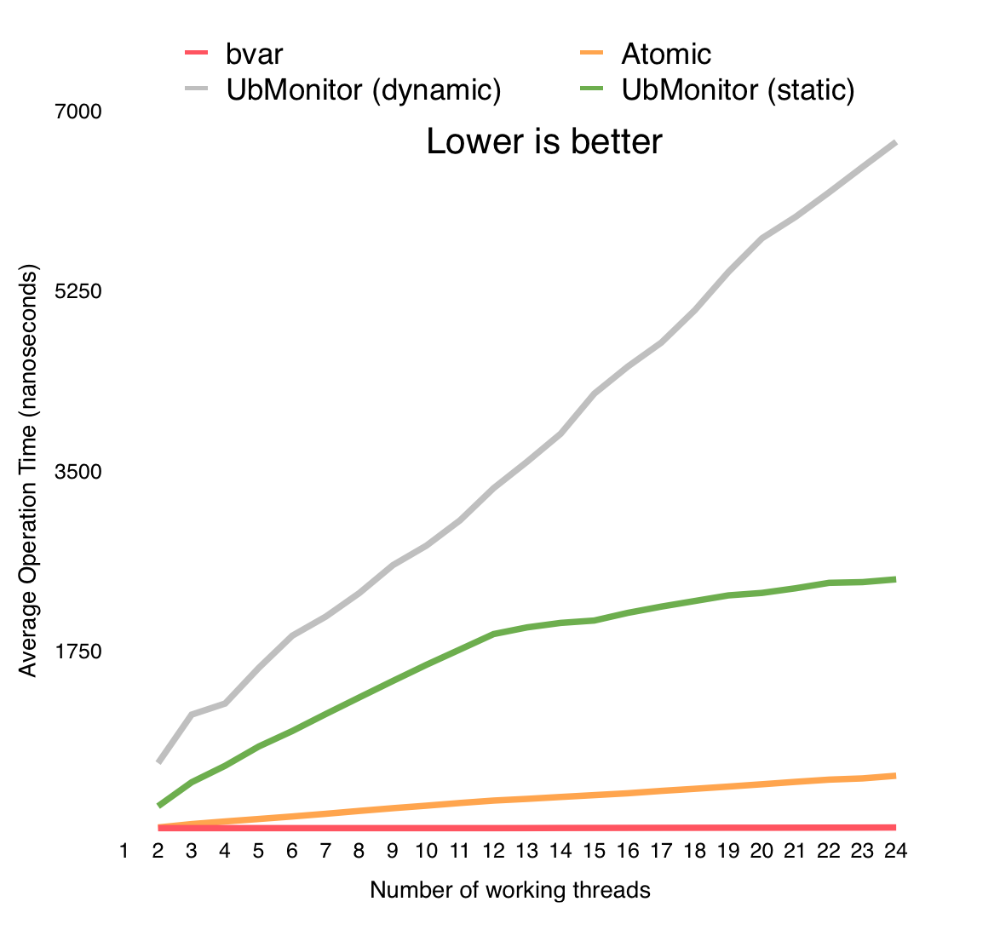
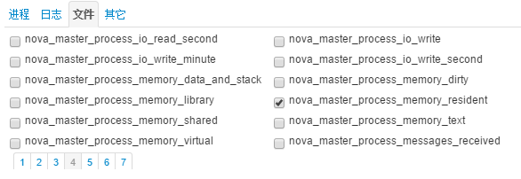
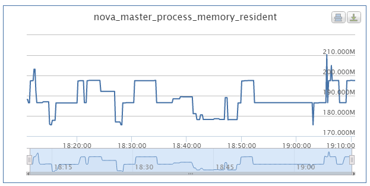

# 1.什么是bvar？

[public/bvar](http://icode.baidu.com/repo/baidu/opensource/baidu-rpc/files/master/blob/src/)是多线程环境下的计数器类库，方便记录和查看用户程序中的各类数值，它利用了thread local存储避免了cache bouncing，相比UbMonitor几乎不会给程序增加性能开销，也快于竞争频繁的原子操作。baidu-rpc集成了bvar，[/vars](http://brpc.baidu.com:8765/vars)可查看所有曝光的bvar，[/vars/VARNAME](http://brpc.baidu.com:8765/vars/rpc_socket_count)可查阅某个bvar，在rpc中的具体使用方法请查看[这里](vars.md)。baidu-rpc大量使用了bvar提供统计数值，当你需要在多线程环境中计数并展现时，应该第一时间想到bvar。但bvar不能代替所有的计数器，它的本质是把写时的竞争转移到了读：读得合并所有写过的线程中的数据，而不可避免地变慢了。当你读写都很频繁并得基于数值做一些逻辑判断时，你不应该用bvar。

# 2.什么是cache bouncing？

为了以较低的成本大幅提高性能，现代CPU都有[cache](https://en.wikipedia.org/wiki/CPU_cache)。百度内常见的Intel E5-2620拥有32K的L1 dcache和icache，256K的L2 cache和15M的L3 cache。其中L1和L2cache为每个核独有，L3则所有核共享。为了保证所有的核看到正确的内存数据，一个核在写入自己的L1 cache后，CPU会执行[Cache一致性](https://en.wikipedia.org/wiki/Cache_coherence)算法把对应的[cacheline](https://en.wikipedia.org/wiki/CPU_cache#Cache_entries)(一般是64字节)同步到其他核。这个过程并不很快，是微秒级的，相比之下写入L1 cache只需要若干纳秒。当很多线程在频繁修改某个字段时，这个字段所在的cacheline被不停地同步到不同的核上，就像在核间弹来弹去，这个现象就叫做cache bouncing。由于实现cache一致性往往有硬件锁，cache bouncing是一种隐式的的全局竞争。关于竞争请查阅[atomic instructions](atomic_instructions.md)。

cache bouncing使访问频繁修改的变量的开销陡增，甚至还会使访问同一个cacheline中不常修改的变量也变慢，这个现象是[false sharing](https://en.wikipedia.org/wiki/False_sharing)。按cacheline对齐能避免false sharing，但在某些情况下，我们甚至还能避免修改“必须”修改的变量。bvar便是这样一个例子，当很多线程都在累加一个计数器时，我们让每个线程累加私有的变量而不参与全局竞争，在读取时我们累加所有线程的私有变量。虽然读比之前慢多了，但由于这类计数器的读多为低频展现，慢点无所谓。而写就快多了，从微秒到纳秒，几百倍的差距使得用户可以无所顾忌地使用bvar，这便是我们设计bvar的目的。

下图是bvar和原子变量，静态UbMonitor，动态UbMonitor的性能对比。可以看到bvar的耗时基本和线程数无关，一直保持在极低的水平（~20纳秒）。而动态UbMonitor在24核时每次累加的耗时达7微秒，这意味着使用300次bvar的开销才抵得上使用一次动态UbMonitor变量。



# 3.用noah监控bvar


- bvar 将被监控的项目定期打入文件：monitor/bvar.<app>.data。
- noah 自动收集文件并生成图像。
- App只需要注册相应的监控项即可。

每个App必须做到的最低监控要求如下：

- **Error**: 要求系统中每个可能出现的error都有监控 
- **Latency**: 系统对外的每个rpc请求的latency；  系统依赖的每个后台的每个request的latency;  (注： 相应的max_latency，系统框架会自动生成)
- **QPS**: 系统对外的每个request的QPS; 系统依赖的每个后台的每个request的QPS.

后面会在完善monitoring框架的过程中要求每个App添加新的必需字段。

# 4.RD要干的事情

## 1.定义bvar

```c++
#include <bvar/bvar.h>
 
namespace foo {
namespace bar {
 
// bvar::Adder<T>用于累加，下面定义了一个统计read error总数的Adder。
bvar::Adder<int> g_read_error;
// 把bvar::Window套在其他bvar上就可以获得时间窗口内的值。
bvar::Window<bvar::Adder<int> > g_read_error_minute("foo_bar", "read_error", &g_read_error, 60);
//                                                     ^          ^                         ^
//                                                    前缀       监控项名称                  60秒,忽略则为10秒
 
// bvar::LatencyRecorder是一个复合变量，可以统计：总量、qps、平均延时，延时分位值，最大延时。
bvar::LatencyRecorder g_write_latency(“foo_bar", "write”);
//                                      ^          ^
//                                     前缀       监控项，别加latency！LatencyRecorder包含多个bvar，它们会加上各自的后缀，比如write_qps, write_latency等等。
 
// 定义一个统计“已推入task”个数的变量。
bvar::Adder<int> g_task_pushed("foo_bar", "task_pushed");
// 把bvar::PerSecond套在其他bvar上可以获得时间窗口内*平均每秒*的值，这里是每秒内推入task的个数。
bvar::PerSecond<bvar::Adder<int> > g_task_pushed_second("foo_bar", "task_pushed_second", &g_task_pushed);
//       ^                                                                                             ^
//    和Window不同，PerSecond会除以时间窗口的大小.                                   时间窗口是最后一个参数，这里没填，就是默认10秒。
 
}  // bar
}  // foo
```

在应用的地方：

```c++
// 碰到read error
foo::bar::g_read_error << 1;
 
// write_latency是23ms
foo::bar::g_write_latency << 23;
 
// 推入了1个task
foo::bar::g_task_pushed << 1;
```

注意Window<>和PerSecond<>都是衍生变量，会自动更新，你不用给它们推值。

>  你当然也可以把bvar作为成员变量或局部变量，请阅读[bvar-c++](bvar_c++.md)。

**确认变量名是全局唯一的！**否则会曝光失败，如果-bvar_abort_on_same_name为true，程序会直接abort。

程序中有来自各种模块不同的bvar，为避免重名，建议如此命名：**模块_类名_指标**

- **模块**一般是程序名，可以加上产品线的缩写，比如inf_ds，ecom_retrbs等等。
- **类名**一般是类名或函数名，比如storage_manager, file_transfer, rank_stage1等等。
- **指标**一般是count，qps，latency这类。

一些正确的命名如下：

```
iobuf_block_count : 29                          # 模块=iobuf   类名=block  指标=count
iobuf_block_memory : 237568                     # 模块=iobuf   类名=block  指标=memory
process_memory_resident : 34709504              # 模块=process 类名=memory 指标=resident
process_memory_shared : 6844416                 # 模块=process 类名=memory 指标=shared
rpc_channel_connection_count : 0                # 模块=rpc     类名=channel_connection  指标=count
rpc_controller_count : 1                        # 模块=rpc     类名=controller 指标=count
rpc_socket_count : 6                            # 模块=rpc     类名=socket     指标=count
```

目前bvar会做名字归一化，不管你打入的是foo::BarNum, foo.bar.num, foo bar num , foo-bar-num，最后都是foo_bar_num。

关于指标：

- 个数以_count为后缀，比如request_count, error_count。
- 每秒的个数以_second为后缀，比如request_second, process_inblocks_second，已经足够明确，不用写成_count_second或_per_second。
- 每分钟的个数以_minute为后缀，比如request_minute, process_inblocks_minute

如果需要使用定义在另一个文件中的计数器，需要在头文件中声明对应的变量。

```c++
namespace foo {
namespace bar {
// 注意g_read_error_minute和g_task_pushed_per_second都是衍生的bvar，会自动更新，不要声明。
extern bvar::Adder<int> g_read_error;
extern bvar::LatencyRecorder g_write_latency;
extern bvar::Adder<int> g_task_pushed;
}  // bar
}  // foo
```

**不要跨文件定义全局Window或PerSecond**

不同编译单元中全局变量的初始化顺序是[未定义的](https://isocpp.org/wiki/faq/ctors#static-init-order)。在foo.cpp中定义`Adder<int> foo_count`，在foo_qps.cpp中定义`PerSecond<Adder<int> > foo_qps(&foo_count);`是**错误**的做法。

计时可以使用base::Timer，接口如下：

```c++
#include <base/time.h>
namespace base {
class Timer {
public:
    enum TimerType { STARTED };
     
    Timer();
 
    // base::Timer tm(base::Timer::STARTED);  // tm is already started after creation.
    explicit Timer(TimerType);
 
    // Start this timer
    void start();
     
    // Stop this timer
    void stop();
 
    // Get the elapse from start() to stop().
    int64_t n_elapsed() const;  // in nanoseconds
    int64_t u_elapsed() const;  // in microseconds
    int64_t m_elapsed() const;  // in milliseconds
    int64_t s_elapsed() const;  // in seconds
};
}  // base
```

## 2.打开bvar的dump功能

bvar可以定期把进程内所有的bvar打印入一个文件中，默认不打开。有几种方法打开这个功能：

- 用[gflags](flags.md)解析输入参数，在程序启动时加入-bvar_dump。gflags的解析方法如下，在main函数处添加如下代码:
```c++
  #include <gflags/gflags.h>
  ...
  int main(int argc, char* argv[]) {
      google::ParseCommandLineFlags(&argc, &argv, true/*表示把识别的参数从argc/argv中删除*/);
      ...
  }
```
- 不想用gflags解析参数，希望直接在程序中默认打开，在main函数处添加如下代码：
```c++
#include <gflags/gflags.h>
...
int main(int argc, char* argv[]) {
    if (google::SetCommandLineOption("bvar_dump", "true").empty()) {
        LOG(FATAL) << "Fail to enable bvar dump";
    }
    ...
}
```

bvar的dump功能由如下参数控制，产品线根据自己的需求调节，需要提醒的是noah要求bvar_dump_file的后缀名是.data，请勿改成其他后缀。更具体的功能描述请阅读[Export all variables](bvar_c++.md#export-all-variables)。

| 名称                      | 默认值                     | 作用                                       |
| ----------------------- | ----------------------- | ---------------------------------------- |
| bvar_abort_on_same_name | false                   | Abort when names of bvar are same        |
| bvar_dump               | false                   | Create a background thread dumping all bvar periodically, all bvar_dump_* flags are not effective when this flag is off |
| bvar_dump_exclude       | ""                      | Dump bvar excluded from these wildcards(separated by comma), empty means no exclusion |
| bvar_dump_file          | monitor/bvar.<app>.data | Dump bvar into this file                 |
| bvar_dump_include       | ""                      | Dump bvar matching these wildcards(separated by comma), empty means including all |
| bvar_dump_interval      | 10                      | Seconds between consecutive dump         |
| bvar_dump_prefix        | <app>                   | Every dumped name starts with this prefix |
| bvar_dump_tabs          | 见代码                     | Dump bvar into different tabs according to the filters (seperated by semicolon), format: *(tab_name=wildcards) |

## 3.编译并重启应用程序

检查monitor/bvar.<app>.data是否存在：

```
$ ls monitor/
bvar.echo_client.data  bvar.echo_server.data
 
$ tail -5 monitor/bvar.echo_client.data
process_swaps : 0
process_time_real : 2580.157680
process_time_system : 0.380942
process_time_user : 0.741887
process_username : "gejun"
```

## 4.打开[noah](http://noah.baidu.com/)

搜索监控节点：


 

点击“文件”tab，勾选要查看的统计量，bvar已经统计了进程级的很多参数，大都以process开头。



 

查看趋势图：


