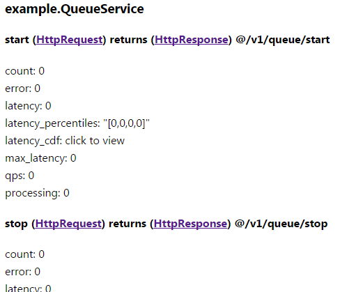

这里特指“纯粹"的HTTP service，而不是可通过HTTP访问的pb服务。虽然用不到pb消息，但“纯粹”的HTTP Service也必须定义在.proto文件中，只是request和response都是空的结构体。这么做是确保所有的服务声明集中在proto文件中，而不是散列在.proto、程序、配置等多个地方。示例代码见[http_server.cpp](http://icode.baidu.com/repo/baidu/opensource/baidu-rpc/files/master/blob/example/http_c++/http_server.cpp)。

# URL前缀为/ServiceName/MethodName

所有pb service默认都能通过/ServiceName/MethodName来访问，其中ServiceName不包括package。对于公司内的纯HTTP服务，一般来说这种形式的URL也够用了。实现步骤如下：

1. 填写proto文件。

下面代码里的HttpRequest和HttpResponse都是空的，因为http数据在Controller中。http request的头在Controller.http_request()中，body在Controller.request_attachment()中。类似的，http response的头在Controller.http_response()，body在Controller.response_attachment()。

```protobuf
option cc_generic_services = true;
 
message HttpRequest { };
message HttpResponse { };
 
service HttpService {
      rpc Echo(HttpRequest) returns (HttpResponse);
};
```

2. 实现Service。和其他pb service一样，也是继承定义在.pb.h中的service基类。

```c++
class HttpServiceImpl : public HttpService {
public:
    ...
    virtual void Echo(google::protobuf::RpcController* cntl_base,
                      const HttpRequest* /*request*/,
                      HttpResponse* /*response*/,
                      google::protobuf::Closure* done) {
        brpc::ClosureGuard done_guard(done);
        brpc::Controller* cntl = static_cast<brpc::Controller*>(cntl_base);
 
        // 这里返回纯文本。
        cntl->http_response().set_content_type("text/plain");
       
        // 把请求的query-string和body打印出来，作为回复内容。
        base::IOBufBuilder os;
        os << "queries:";
        for (brpc::URI::QueryIterator it = cntl->http_request().uri().QueryBegin();
                it != cntl->http_request().uri().QueryEnd(); ++it) {
            os << ' ' << it->first << '=' << it->second;
        }
        os << "\nbody: " << cntl->request_attachment() << '\n';
        os.move_to(cntl->response_attachment());
    }
};
```

实现完毕插入Server后可通过如下URL访问，/HttpService/Echo后的部分在 cntl->http_request().unresolved_path()中，unresolved_path总是normalized。

| URL                        | 访问方法             | cntl->http_request().uri().path() | cntl->http_request().unresolved_path() |
| -------------------------- | ---------------- | --------------------------------- | -------------------------------------- |
| /HttpService/Echo          | HttpService.Echo | "/HttpService/Echo"               | ""                                     |
| /HttpService/Echo/Foo      | HttpService.Echo | "/HttpService/Echo/Foo"           | "Foo"                                  |
| /HttpService/Echo/Foo/Bar  | HttpService.Echo | "/HttpService/Echo/Foo/Bar"       | "Foo/Bar"                              |
| /HttpService//Echo///Foo// | HttpService.Echo | "/HttpService//Echo///Foo//"      | "Foo"                                  |
| /HttpService               | 访问错误             |                                   |                                        |

# URL前缀为/ServiceName

一些资源类的HTTP服务可能会需要这种类型的URL，比如FileService提供对文件的访问，/FileService/foobar.txt代表访问运行目录下的foobar.txt文件，而/FileService/app/data/boot.cfg代表app/data目录下的boot.cfg文件。

实现方法：

1. proto文件中应以FileService为服务名，以default_method为方法名。

```protobuf
option cc_generic_services = true;
 
message HttpRequest { };
message HttpResponse { };
 
service FileService {
      rpc default_method(HttpRequest) returns (HttpResponse);
}
```

2. 实现Service。

```c++
class FileServiceImpl: public FileService {
public:
    ...
    virtual void default_method(google::protobuf::RpcController* cntl_base,
                                const HttpRequest* /*request*/,
                                HttpResponse* /*response*/,
                                google::protobuf::Closure* done) {
        brpc::ClosureGuard done_guard(done);
        brpc::Controller* cntl = static_cast<brpc::Controller*>(cntl_base);
        cntl->response_attachment().append("Getting file: ");
        cntl->response_attachment().append(cntl->http_request().unresolved_path());
    }
};
```

实现完毕插入Server后可通过如下URL访问，/FileService之后的路径在cntl->http_request().unresolved_path()中 (r32097前被称为method_path)，unresolved_path总是normalized。

| URL                             | 访问方法                       | cntl->http_request().uri().path() | cntl->http_request().unresolved_path() |
| ------------------------------- | -------------------------- | --------------------------------- | -------------------------------------- |
| /FileService                    | FileService.default_method | "/FileService"                    | ""                                     |
| /FileService/123.txt            | FileService.default_method | "/FileService/123.txt"            | "123.txt"                              |
| /FileService/mydir/123.txt      | FileService.default_method | "/FileService/mydir/123.txt"      | "mydir/123.txt"                        |
| /FileService//mydir///123.txt// | FileService.default_method | "/FileService//mydir///123.txt//" | "mydir/123.txt"                        |

# Restful URL

r32097后，baidu-rpc支持为service中的每个方法指定一个URL。接口如下：

```c++
// 如果restful_mappings不为空, service中的方法可通过指定的URL被HTTP协议访问，而不是/ServiceName/MethodName. 
// 映射格式："PATH1 => NAME1, PATH2 => NAME2 ..."
// PATHs是有效的HTTP路径, NAMEs是service中的方法名.                                                     
int AddService(google::protobuf::Service* service,
               ServiceOwnership ownership,
               base::StringPiece restful_mappings);
```

比如下面的QueueService包含多个http方法。

```protobuf
service QueueService {
    rpc start(HttpRequest) returns (HttpResponse);
    rpc stop(HttpRequest) returns (HttpResponse);
    rpc get_stats(HttpRequest) returns (HttpResponse);
    rpc download_data(HttpRequest) returns (HttpResponse);
};
```

如果我们像之前那样把它插入server，那么只能通过`/QueueService/start, /QueueService/stop等url来访问`。

而在调用AddService时指定第三个参数(restful_mappings)就能定制URL了，如下所示：

```c++
// r33521前星号只能出现在最后
if (server.AddService(&queue_svc,
                      brpc::SERVER_DOESNT_OWN_SERVICE,
                      "/v1/queue/start   => start,"
                      "/v1/queue/stop    => stop,"
                      "/v1/queue/stats/* => get_stats") != 0) {
    LOG(ERROR) << "Fail to add queue_svc";
    return -1;
}
 
// r33521后星号可出现在中间
if (server.AddService(&queue_svc,
                      brpc::SERVER_DOESNT_OWN_SERVICE,
                      "/v1/*/start   => start,"
                      "/v1/*/stop    => stop,"
                      "*.data        => download_data") != 0) {
    LOG(ERROR) << "Fail to add queue_svc";
    return -1;
}
```

上面代码中AddService的第三个参数分了三行，但实际上是一个字符串。这个字符串包含以逗号(,)分隔的三个映射关系，每个映射告诉baidu-rpc：在遇到箭头左侧的URL时调用右侧的方法。"/v1/queue/stats/*"中的星号可匹配任意字串。在r33521前星号只能加在URL最后。

关于映射规则：

- 多个路径可映射至同一个方法。
- service不要求是纯HTTP，pb service也支持。
- 没有出现在映射中的方法仍旧通过/ServiceName/MethodName访问。出现在映射中的方法不再能通过/ServiceName/MethodName访问。
- ==> ===> ...都是可以的。开头结尾的空格，额外的斜杠(/)，最后多余的逗号，都不要紧。
- r33521前PATH和PATH/* 是冲突的，不能同时出现在一个字符串中。r33521后两者可以共存。
- r33521前星号后不能有更多字符，r33521后可以，即支持后缀匹配。
- 一个路径中只能出现一个星号。

`cntl.http_request().unresolved_path()` 对应星号(*)匹配的部分，保证normalized：开头结尾都不包含斜杠(/)，中间斜杠不重复。比如：


或


unresolved_path都是`"foo/bar"`，左右、中间多余的斜杠被移除了。

 注意：`cntl.http_request().uri().path()`不保证normalized，这两个例子中分别为`"//v1//queue//stats//foo///bar//////"`和`"//vars///foo////bar/////"`

 

/status页面上的方法名后会加上所有相关的URL，形式是：@URL1 @URL2 ...



# HTTP参数

## HTTP headers

http header是一系列key/value对，有些由HTTP协议规定有特殊含义，其余则由用户自由设定。

http headers易与query string混淆，后者是URL的一部分，常见形式是key1=value1&key2=value2&...，也可以表达key/value关系，且更容易在界面上操作。但用query string表达key/value并不是HTTP规范的一部分，更多是大家约定成俗的方式。就我的感受而言，由于http headers是协议的一部分，被所有http server认知，所以常用于机器接口，传递框架或协议层面的参数；而query string作为URL的一部分，很方便被人修改和阅读，常用于传递用户层面的参数。

```c++
// 获得header中"User-Agent"的值，大小写不敏感。
const std::string* user_agent_str = cntl->http_request().GetHeader("User-Agent");
if (user_agent_str != NULL) {  // has the header
    LOG(TRACE) << "User-Agent is " << *user_agent_str;
}
...
 
// 在header中增加"Accept-encoding: gzip"，大小写不敏感。
cntl->http_response().SetHeader("Accept-encoding", "gzip");
// 覆盖为"Accept-encoding: deflate"
cntl->http_response().SetHeader("Accept-encoding", "deflate");
// 增加一个value，逗号分隔，变为"Accept-encoding: deflate,gzip"
cntl->http_response().AppendHeader("Accept-encoding", "gzip");
```

## Content-Type

Content-type记录body的类型，是一个使用频率较高的header，单独抽取出来方便使用，相应地，GetHeader()获取不到Content-Type。

```c++
// Get Content-Type
if (cntl->http_request().content_type() == "application/json") {
    ...
}
...
// Set Content-Type
cntl->http_response().set_content_type("text/html");
```

如果RPC失败(Controller被SetFailed), Content-Type会框架强制设为text/plain，而response body设为Controller::ErrorText()。

## Status Code

status code是http response特有的字段，标记http请求的完成情况。请使用定义在[http_status_code.h](http://icode.baidu.com/repo/baidu/opensource/baidu-rpc/files/master/blob/src/brpc/http_status_code.h)中的enum，遵守HTTP协议。

```c++
// Get Status Code
if (cntl->http_response().status_code() == brpc::HTTP_STATUS_NOT_FOUND) {
    LOG(FATAL) << "FAILED: " << controller.http_response().reason_phrase();
}
...
// Set Status code
cntl->http_response().set_status_code(brpc::HTTP_STATUS_INTERNAL_SERVER_ERROR);
cntl->http_response().set_status_code(brpc::HTTP_STATUS_INTERNAL_SERVER_ERROR, "My explanation of the error...");
```

以下代码在302错误时重定向：

```c++
cntl->http_response().set_status_code(brpc::HTTP_STATUS_FOUND);
cntl->http_response().SetHeader("Location", "http://bj.bs.bae.baidu.com/family/image001(4979).jpg");
```


## Query String

如上面的[HTTP headers](http_service.md#http-headers)中提到的那样，我们按约定成俗的方式来理解query string，即key1=value1&key2=value2&...。只有key而没有value也是可以的，仍然会被GetQuery查询到，只是值为空字符串，这常被用做bool型的开关。接口定义在[uri.h](http://icode.baidu.com/repo/baidu/opensource/baidu-rpc/files/master/blob/src/brpc/uri.h)。

```c++
const std::string* time_value = cntl->http_request().uri().GetQuery("time");
if (time_value != NULL) {  // the query string is present
    LOG(TRACE) << "time = " << *time_value;
}
 
...
cntl->http_request().uri().SetQuery("time", "2015/1/2");
```

# 查看server收到的请求和发出的回复

打开[-http_verbose](http://brpc.baidu.com:8765/flags/http_verbose)即可在stderr看到所有的http request和response，注意这应该只用于线下调试，而不是线上程序。 

# 压缩response body

http服务常对http body进行压缩，对于文本网页可以有效减少传输时间，加快页面的展现速度。

在r33093后，调用Controller::set_response_compress_type(brpc::COMPRESS_TYPE_GZIP)将尝试用gzip压缩http body，并设置"Content-Encoding"为"gzip"。“尝试”指的是如果请求中没有设置Accept-encoding或不包含gzip，压缩不会进行。比如curl不加--compressed时是不支持压缩的，这时server端总是会返回不压缩的结果。

# 解压request body

出于通用性考虑且解压代码不复杂，baidu-rpc不会自动解压request body，用户可以自己做，方法如下：

```c++
#include <brpc/policy/gzip_compress.h>
...
const std::string* encoding = cntl->http_request().GetHeader("Content-Encoding");
if (encoding != NULL && *encoding == "gzip") {
    base::IOBuf uncompressed;
    if (!brpc::policy::GzipDecompress(cntl->request_attachment(), &uncompressed)) {
        LOG(ERROR) << "Fail to un-gzip request body";
        return;
    }
    cntl->request_attachment().swap(uncompressed);
}
// cntl->request_attachment()中已经是解压后的数据了
```


# 开启HTTPS

要开启HTTPS，首先确保你的COMAKE/BCLOUD中依赖有最新的openssl库（openssl-1.0.2h）

```python
CONFIGS('third-64/openssl@1.0.2.6123')
```
因为大部分机器自带的openssl版本很旧，有严重的安全漏洞，支持的加密算法也少，违背了开启SSL的初衷
然后在设置ServerOptions中的SSLOptions
```c++
// 证书结构
struct CertInfo {
    // PEM格式证书文件
    // 当存在证书链时, 将所有证书链上的证书append为一个文件
    std::string certificate_file;
  
    // PEM格式的密钥文件
    std::string private_key_file;
  
    // 指定该证书绑定的域名，首字符支持通配符（类似*.abc.com）
    // 访问这些域名的请求，会使用该证书进行SSL握手，在client最终显示该证书的信息
    // 如果没指定此字段，程序会自动尝试从证书文件中提取域名信息
    std::vector<std::string> sni_filters;
};
 
struct SSLOptions {
    // 要加载的所有证书
    std::vector<CertInfo> certs;
 
    // 当HTTPS请求到来时，会自动根据访问域名找相应的证书
    // 如果没有找到相匹配的证书，默认情况使用certs中的第一张证书
    // 除非开启strict_sni，则此时会拒绝该请求
    bool strict_sni;
 
    // ... 其他选项
};
```
其余选项还包括：密钥套件选择（推荐密钥ECDHE-RSA-AES256-GCM-SHA384，chrome默认第一优先密钥，安全性很高，但比较耗性能）、session复用等，具体见server.h
另外，开启HTTPS后，原先的HTTP请求也可以通过同一个端口来访问，Server会自动判断哪些是HTTP，哪些是HTTPS；用户也可以在callback中通过Controller接口来判断：
```c++
bool Controller::is_ssl() const;
```

# 性能

没有极端性能要求的产品线都有使用HTTP协议的倾向，特别是移动端产品线，所以我们很重视HTTP的实现质量，具体来说：

- 使用了node.js的[http parser](http://icode.baidu.com/repo/baidu/opensource/baidu-rpc/files/master/blob/src/brpc/details/http_parser.h)(部分来自nginx)解析http消息，这是一个轻量、优秀的实现。
- 使用[rapidjson](https://github.com/miloyip/rapidjson)解析json，这是一个主打性能的json库，由一位腾讯专家开发。
- 在最差情况下解析http请求的时间复杂度也是O(N)，其中N是请求的字节数。反过来说，如果解析代码要求http请求是完整的，那么它可能会花费O(N^2)的时间。HTTP请求普遍较大，这一点意义还是比较大的。
- 来自不同client的http消息是高度并发的，即使相当复杂的http消息也不会影响对其他客户端的响应。其他rpc和[基于单线程reactor](threading_overview.md#单线程reactor)的各类http server往往难以做到这一点。

# 持续发送

r33796前baidu-rpc server不适合发送超大或无限长的body。r33796后baidu-rpc server支持。方法如下:

1. 调用Controller::CreateProgressiveAttachment()创建可持续发送的body。
  `boost::intrusive_ptr<brpc::ProgressiveAttachment> pa(cntl->CreateProgressiveAttachment());`
  返回的ProgressiveAttachment对象需要用boost::intrusive_ptr<>管理，定义在brpc/progressive_attachment.h>中。

2. 调用ProgressiveAttachment::Write()发送数据。如果写入发生在server回调结束前，发送的数据将会被缓存直到回调结束发送了header部分后才会开始发送数据。如果写入发生在server回调结束后，发送的数据将立刻以chunked mode写出。 
3. 发送完毕后确保所有的boost::intrusive_ptr<brpc::ProgressiveAttachment>都析构了。

# 持续接收

目前baidu-rpc server不支持在接受完http请求的header部分就调用用户的服务回调，即baidu-rpc server不适合接收超长或无限长的body。

# FAQ

### Q: baidu-rpc前的nginx报了final fail (ff)

baidu-rpc server同端口支持多种协议，当它遇到非法HTTP请求并解析失败后，无法说这个请求一定是HTTP。在r31355之后，server会对query-string及之后出现解析错误的请求返回HTTP 400错误并关闭连接（因为有很大概率是HTTP请求），但如果是HTTP method错误，诸如出现GET、POST、HEAD等标准方法之外的东西或严重的格式错误（可能由HTTP client有bug导致），server仍会直接断开连接，导致nginx的ff。

解决方案: 在使用Nginx转发流量时，可以对$HTTP_method做一下过滤，只放行允许的方法。或者干脆在proxy时设置proxy_method为指定方法，来避免ff。 

### Q: baidu-rpc支持http chunked方式传输吗

支持。

### Q: HTTP请求的query string中含有BASE64编码过的value，为什么有时候无法正常解析

根据[HTTP协议](http://tools.ietf.org/html/rfc3986#section-2.2)中的要求，以下字符应该使用%编码

```
       reserved    = gen-delims / sub-delims

       gen-delims  = ":" / "/" / "?" / "#" / "[" / "]" / "@"

       sub-delims  = "!" / "$" / "&" / "'" / "(" / ")"
                   / "*" / "+" / "," / ";" / "="
```

Base64 编码后的字符串中，会以"="或者"=="作为结尾(比如: ?wi=NDgwMDB8dGVzdA==&anothorkey=anothervalue), 这个字段可能会被正确解析，也可能不会，取决于具体实现，用户不应该做任何假设.

一个解决方法是删除末尾的"=", 不影响Base64的[正常解码](http://en.wikipedia.org/wiki/Base64#Padding); 第二个方法是在这个URI在base64之后在使用%编码，使用的地方先进行%解码，然后再用base64解码.
