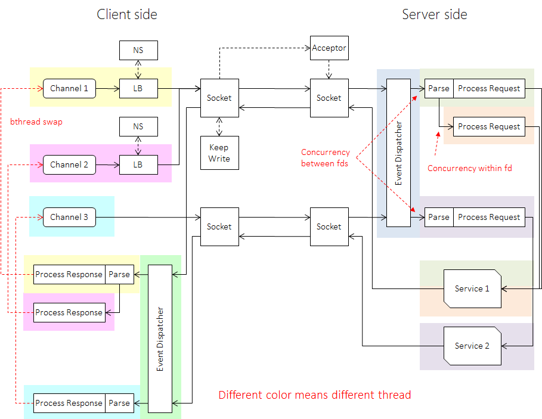

一般有三种操作IO的方式：

- blocking IO: 发起IO操作后阻塞当前线程直到IO结束，标准的同步IO，如默认行为的posix [read](http://linux.die.net/man/2/read)和[write](http://linux.die.net/man/2/write)。
- non-blocking IO: 发起IO操作后不阻塞，用户可阻塞等待多个IO操作同时结束。non-blocking也是一种同步IO：“批量的同步”。如linux下的[poll](http://linux.die.net/man/2/poll),[select](http://linux.die.net/man/2/select), [epoll](http://linux.die.net/man/4/epoll)，BSD下的[kqueue](https://www.freebsd.org/cgi/man.cgi?query=kqueue&sektion=2)。
- asynchronous IO: 发起IO操作后不阻塞，用户得递一个回调待IO结束后被调用。如windows下的[OVERLAPPED](https://msdn.microsoft.com/en-us/library/windows/desktop/ms684342(v=vs.85).aspx) + [IOCP](https://msdn.microsoft.com/en-us/library/windows/desktop/aa365198(v=vs.85).aspx)。linux的native AIO只对文件有效。

linux一般使用non-blocking IO提高IO并发度。当IO并发度很低时，non-blocking IO不一定比blocking IO更高效，因为后者完全由内核负责，而read/write这类系统调用已高度优化，效率显然高于一般得多个线程协作的non-blocking IO。但当IO并发度愈发提高时，blocking IO阻塞一个线程的弊端便显露出来：内核得不停地在线程间切换才能完成有效的工作，一个cpu core上可能只做了一点点事情，就马上又换成了另一个线程，cpu cache没得到充分利用，另外大量的线程会使得依赖thread-local加速的代码性能明显下降，如tcmalloc，一旦malloc变慢，程序整体性能往往也会随之下降。而non-blocking IO一般由少量event dispatching线程和一些运行用户逻辑的worker线程组成，这些线程往往会被复用（换句话说调度工作转移到了用户态），event dispatching和worker可以同时在不同的核运行（流水线化），内核不用频繁的切换就能完成有效的工作。线程总量也不用很多，所以对thread-local的使用也比较充分。这时候non-blocking IO就往往比blocking IO快了。不过non-blocking IO也有自己的问题，它需要调用更多系统调用，比如[epoll_ctl](http://man7.org/linux/man-pages/man2/epoll_ctl.2.html)，由于epoll实现为一棵红黑树，epoll_ctl并不是一个很快的操作，特别在多核环境下，依赖epoll_ctl的实现往往会面临棘手的扩展性问题。non-blocking需要更大的缓冲，否则就会触发更多的事件而影响效率。non-blocking还得解决不少多线程问题，代码比blocking复杂很多。

# 收消息

“消息”指从连接读入的有边界的二进制串，可能是来自上游client的request或来自下游server的response。baidu-rpc使用一个或多个[EventDispatcher](http://icode.baidu.com/repo/baidu/opensource/baidu-rpc/files/master/blob/src/brpc/event_dispatcher.h)(简称为EDISP)等待任一fd发生事件。和常见的“IO线程”不同，EDISP不负责读取。IO线程的问题在于一个线程同时只能读一个fd，当多个繁忙的fd聚集在一个IO线程中时，一些读取就被延迟了。多租户、复杂分流算法，[Streaming RPC](streaming_rpc.md)等功能会加重这个问题。高负载下偶尔的长延时read也会拖慢一个IO线程中所有fd的读取，对可用性的影响幅度较大。

由于epoll的[一个bug](https://patchwork.kernel.org/patch/1970231/)及epoll_ctl较大的开销，EDISP使用Edge triggered模式。当收到事件时，EDISP给一个原子变量加1，只有当加1前的值是0时启动一个bthread处理对应fd上的数据。在背后，EDISP把所在的pthread让给了新建的bthread，使其有更好的cache locality，可以尽快地读取fd上的数据。而EDISP所在的bthread会被偷到另外一个pthread继续执行，这个过程即是bthread的work stealing调度。要准确理解那个原子变量的工作方式可以先阅读[atomic instructions](atomic_instructions.md)，再看[Socket::StartInputEvent](http://icode.baidu.com/repo/baidu/opensource/baidu-rpc/files/master/blob/src/brpc/socket.cpp)。这些方法使得baidu-rpc读取同一个fd时产生的竞争是[wait-free](http://en.wikipedia.org/wiki/Non-blocking_algorithm#Wait-freedom)的。

[InputMessenger](http://icode.baidu.com/repo/baidu/opensource/baidu-rpc/files/master/blob/src/brpc/input_messenger.h)负责从fd上切割和处理消息，它通过用户回调函数理解不同的格式。Parse一般是把消息从二进制流上切割下来，运行时间较固定；Process则是进一步解析消息(比如反序列化为protobuf)后调用用户回调，时间不确定。InputMessenger会逐一尝试用户指定的多套回调，当某一个Parse成功切割下一个消息后，调用对应的Process。由于一个连接上往往只有一种消息格式，InputMessenger会记录下上次的选择，而避免每次都重复尝试。若一次从某个fd读取出n个消息(n > 1)，InputMessenger会启动n-1个bthread分别处理前n-1个消息，最后一个消息则会在原地被Process。

可以看到，fd间和fd内的消息都会在baidu-rpc中获得并发，这使baidu-rpc非常擅长大消息的读取，在高负载时仍能及时处理不同来源的消息，减少长尾的存在。

# 发消息

"消息”指向连接写出的有边界的二进制串，可能是发向上游client的response或下游server的request。多个线程可能会同时向一个fd发送消息，而写fd又是非原子的，所以如何高效率地排队不同线程写出的数据包是这里的关键。baidu-rpc使用一种wait-free MPSC链表来实现这个功能。所有待写出的数据都放在一个单链表节点中，next指针初始化为一个特殊值(Socket::WriteRequest::UNCONNECTED)。当一个线程想写出数据前，它先尝试和对应的链表头(Socket::_write_head)做原子交换，返回值是交换前的链表头。如果返回值为空，说明它获得了写出的权利，它会在原地写一次数据。否则说明有另一个线程在写，它把next指针指向返回的头，那样正在写的线程之后会看到并写出这块数据。这套方法可以让写竞争是wait-free的，而获得写权利的线程虽然在原理上不是wait-free也不是lock-free，可能会被一个值仍为UNCONNECTED的节点锁定（这需要发起写的线程正好在原子交换后，在设置next指针前，仅仅一条指令的时间内被OS换出），但在实践中很少出现。在当前的实现中，如果获得写权利的线程一下子无法写出所有的数据，会启动一个KeepWrite线程继续写，直到所有的数据都被写出。这套逻辑非常复杂，大致原理如下图，细节请阅读[socket.cpp](http://icode.baidu.com/repo/baidu/opensource/baidu-rpc/files/master/blob/src/brpc/socket.cpp)。

由于baidu-rpc的写出总能很快地返回，调用线程可以更快地处理新任务，后台写线程也能每次拿到一批任务批量写出，在大吞吐时容易形成流水线效应而提高IO效率。

# Socket

和fd相关的数据均在[Socket](http://icode.baidu.com/repo/baidu/opensource/baidu-rpc/files/master/blob/src/brpc/socket.h)中，是rpc最复杂的结构之一，这个结构的独特之处在于用64位的SocketId指代Socket对象以方便在多线程环境下使用fd。常用的三个方法：

- Create：创建Socket，并返回其SocketId。
- Address：取得id对应的Socket，包装在一个会自动释放的unique_ptr中(SocketUniquePtr)，当Socket被SetFailed后，返回指针为空。只要Address返回了非空指针，其内容保证不会变化，直到指针自动析构。这个函数是wait-free的。
- SetFailed：标记一个Socket为失败，之后所有对那个SocketId的Address会返回空指针（直到健康检查成功）。当Socket对象没人使用后会被回收。这个函数是lock-free的。

可以看到Socket类似[shared_ptr](http://en.cppreference.com/w/cpp/memory/shared_ptr)，SocketId类似[weak_ptr](http://en.cppreference.com/w/cpp/memory/weak_ptr)，但Socket独有的SetFailed可以在需要时确保Socket不能被继续Address而最终引用计数归0，单纯使用shared_ptr/weak_ptr则无法保证这点，当一个server需要退出时，如果请求仍频繁地到来，对应Socket的引用计数可能迟迟无法清0而导致server无法退出。另外weak_ptr无法直接作为epoll的data，而SocketId可以。这些因素使我们设计了Socket，这个类的核心部分自14年10月完成后很少改动，非常稳定。

存储SocketUniquePtr还是SocketId取决于是否需要强引用。像Controller贯穿了RPC的整个流程，和Socket中的数据有大量交互，它存放的是SocketUniquePtr。epoll主要是提醒对应fd上发生了事件，如果Socket回收了，那这个事件是可有可无的，所以它存放了SocketId。由于SocketUniquePtr只要有效，其中的数据就不会变，这个机制使用户不用关心麻烦的race conditon和ABA problem，可以放心地对共享的fd进行操作。这种方法也规避了隐式的引用计数，内存的ownership明确，程序的质量有很好的保证。baidu-rpc中有大量的SocketUniquePtr和SocketId，它们确实简化了我们的开发。

事实上，Socket不仅仅用于管理原生的fd，它也被用来管理其他资源。比如SelectiveChannel中的每个Sub Channel都被置入了一个Socket中，这样SelectiveChannel可以像普通channel选择下游server那样选择一个Sub Channel进行发送。这个假Socket甚至还实现了健康检查。Streaming RPC也使用了Socket以复用wait-free的写出过程。

# The full picture

