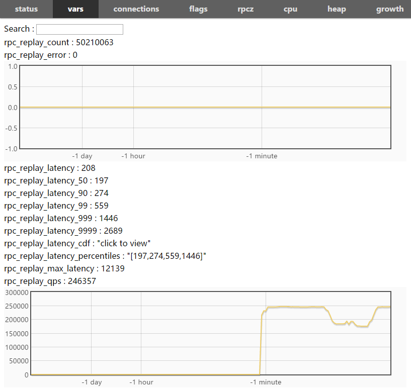

r31658后，brpc能随机地把一部分请求写入一些文件中，并通过rpc_replay工具回放。目前支持的协议有：baidu_std, hulu_pbrpc, sofa_pbrpc。

# 获取工具

先按照[Getting Started](getting_started.md)编译好brpc，再去tools/rpc_replay编译。

在CentOS 6.3上如果出现找不到libssl.so.4的错误，可执行`ln -s /usr/lib64/libssl.so.6 libssl.so.4临时解决`

# 采样

brpc通过如下flags打开和控制如何保存请求，包含(R)后缀的flag都可以动态设置。


参数说明：

- -rpc_dump是主开关，关闭时其他以rpc_dump开头的flag都无效。当打开-rpc_dump后，brpc会以一定概率采集请求，如果服务的qps很高，brpc会调节采样比例，使得每秒钟采样的请求个数不超过-bvar_collector_expected_per_second对应的值。这个值在目前同样影响rpcz和contention profiler，一般不用改动，以后会对不同的应用独立开来。
- -rpc_dump_dir：设置存放被dump请求的目录
- -rpc_dump_max_files: 设置目录下的最大文件数，当超过限制时，老文件会被删除以腾出空间。
- -rpc_dump_max_requests_in_one_file：一个文件内的最大请求数，超过后写新文件。

brpc通过一个[bvar::Collector](http://icode.baidu.com/repo/baidu/opensource/brpc/files/master/blob/src/bvar/collector.h)来汇总来自不同线程的被采样请求，不同线程之间没有竞争，开销很小。

写出的内容依次存放在rpc_dump_dir目录下的多个文件内，这个目录默认在./rpc_dump_<app>，其中<app>是程序名。不同程序在同一个目录下同时采样时会写入不同的目录。如果程序启动时rpc_dump_dir已经存在了，目录将被清空。目录中的每个文件以requests.yyyymmdd_hhmmss_uuuuus命名，以保证按时间有序方便查找，比如：


目录下的文件数不超过rpc_dump_max_files，超过后最老的文件被删除从而给新文件腾出位置。

文件是二进制格式，格式与标准协议的二进制格式类似，每个请求的binary layout如下：

```
"PRPC" (4 bytes magic string)
body_size(4 bytes)
meta_size(4 bytes)
RpcDumpMeta (meta_size bytes)
serialized request (body_size - meta_size bytes, including attachment)
```

请求间紧密排列。一个文件内的请求数不超过rpc_dump_max_requests_in_one_file。

> 一个文件可能包含多种协议的请求，如果server被多种协议访问的话。回放时被请求的server也将收到不同协议的请求。

brpc提供了[SampleIterator](http://icode.baidu.com/repo/baidu/opensource/brpc/files/master/blob/src/brpc/rpc_dump.h)从一个采样目录下的所有文件中依次读取所有的被采样请求，用户可根据需求把serialized request反序列化为protobuf请求，做一些二次开发。

```c++
#include <brpc/rpc_dump.h>
...
brpc::SampleIterator it("./rpc_data/rpc_dump/echo_server");         
for (SampleRequest* req = it->Next(); req != NULL; req = it->Next()) {
    ...                    
    // req->meta的类型是brpc::RpcDumpMeta，定义在protocol/brpc/rpc_dump.proto
    // req->request的类型是base::IOBuf，对应格式说明中的"serialized request"
    // 使用结束后必须delete req。
}
```

# 回放

brpc在[tools/rpc_replay](http://icode.baidu.com/repo/baidu/opensource/brpc/files/master/tree/tools/rpc_replay/)提供了默认的回放工具。运行方式如下：


主要参数说明：

- -dir指定了存放采样文件的目录
- -times指定循环回放次数。其他参数请加上--help运行查看。
- -connection_type： 连接server的方式
- -dummy_port：修改dummy_server的端口
- -max_retry：最大重试次数，默认3次。
- -qps：大于0时限制qps，默认为0（不限制）
- -server：server的地址
- -thread_num：发送线程数，为0时会根据qps自动调节，默认为0。一般不用设置。
- -timeout_ms：超时
- -use_bthread：使用bthread发送，默认是。

rpc_replay会默认启动一个仅监控用的dummy server。打开后可查看回放的状况。其中rpc_replay_error是回放失败的次数。



如果你无法打开浏览器，命令行中也会定期打印信息：

```
2016/01/30-16:19:01     sent:101       success:101       error:0         total_error:0         total_sent:28379     
2016/01/30-16:19:02     sent:101       success:101       error:0         total_error:0         total_sent:28480     
2016/01/30-16:19:03     sent:101       success:101       error:0         total_error:0         total_sent:28581     
2016/01/30-16:19:04     sent:101       success:101       error:0         total_error:0         total_sent:28682     
2016/01/30-16:19:05     sent:101       success:101       error:0         total_error:0         total_sent:28783     
2016/01/30-16:19:06     sent:101       success:101       error:0         total_error:0         total_sent:28884     
2016/01/30-16:19:07     sent:101       success:101       error:0         total_error:0         total_sent:28985     
2016/01/30-16:19:08     sent:101       success:101       error:0         total_error:0         total_sent:29086     
2016/01/30-16:19:09     sent:101       success:101       error:0         total_error:0         total_sent:29187     
2016/01/30-16:19:10     sent:101       success:101       error:0         total_error:0         total_sent:29288     
[Latency]
  avg            122 us
  50%            122 us
  70%            135 us
  90%            161 us
  95%            164 us
  97%            166 us
  99%            172 us
  99.9%          199 us
  99.99%         199 us
  max            199 us
```

上方的字段含义应该是自解释的，在此略过。下方是延时信息，第一项"avg"是10秒内的平均延时，最后一项"max"是10秒内的最大延时，其余以百分号结尾的则代表延时分位值，即有左侧这么多比例的请求延时小于右侧的延时（单位微秒）。性能测试需要关注99%之后的长尾区域。
