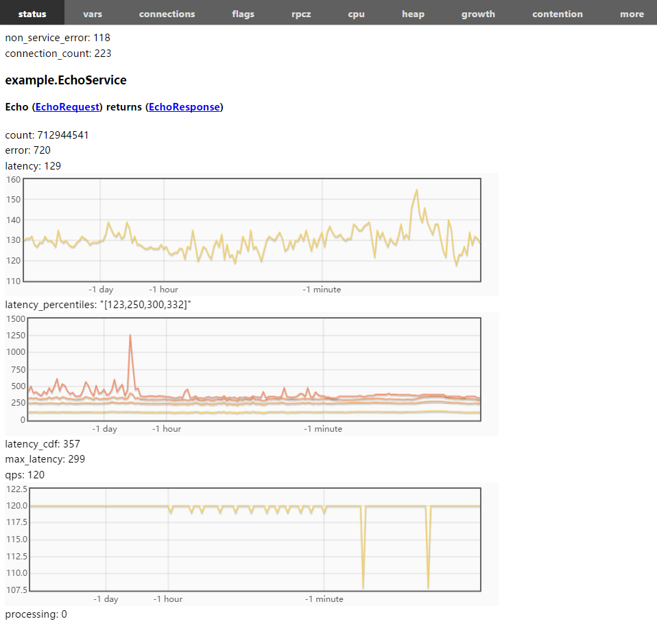
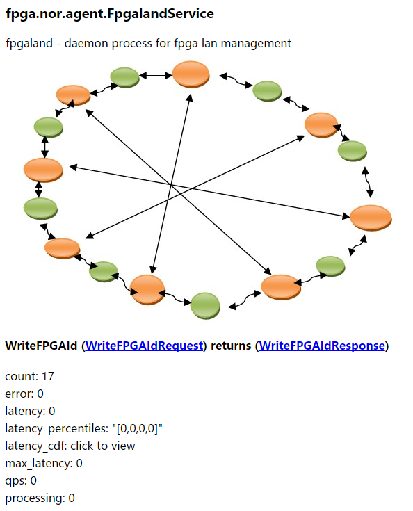

[/status](http://brpc.baidu.com:8765/status)可以访问服务的主要统计信息。这些信息和/vars是同源的，但按服务重新组织方便查看。



上图中字段的含义分别是：

- **non_service_error**: "non"修饰的是“service_error"，后者即是分列在各个服务下的error，此外的error都计入non_service_error。服务处理过程中client断开连接导致无法成功写回response就算non_service_error。而服务内部对后端的连接断开属于服务内部逻辑，只要最终服务成功地返回了response，即使错误也是计入该服务的error，而不是non_service_error。
- **connection_count**: 向该server发起请求的连接个数，不包含[对外连接](http://brpc.baidu.com:8765/vars/rpc_channel_connection_count)的个数。
- **example.EchoService**: 服务的完整名称，包含名字空间。
- **Echo (EchoRequest****) returns (EchoResponse****)**: 方法签名，一个服务可包含多个方法，点击request/response上的链接可查看对应的protobuf结构体。
- **count**: 成功处理的请求总个数。
- **error**: 失败的请求总个数。
- **latency**: 在web界面下从右到左分别是过去60秒，60分钟，24小时，30天的平均延时。在文本界面下是10秒内([-bvar_dump_interval](http://brpc.baidu.com:8765/flags/bvar_dump_interval)控制）的平均延时。
- **latency_percentiles**: 是延时的50%, 90%, 99%, 99.9%分位值，统计窗口默认10秒([-bvar_dump_interval](http://brpc.baidu.com:8765/flags/bvar_dump_interval)控制），web界面下有曲线。
- **latency_cdf**: 是分位值的另一种展现形式，类似histogram，只能在web界面下查看。
- **max_latency**: 在web界面下从右到左分别是过去60秒，60分钟，24小时，30天的最大延时。在文本界面下是10秒内([-bvar_dump_interval](http://brpc.baidu.com:8765/flags/bvar_dump_interval)控制）的最大延时。
- **qps**: 在web界面下从右到左分别是过去60秒，60分钟，24小时，30天的平均qps。在文本界面下是10秒内([-bvar_dump_interval](http://brpc.baidu.com:8765/flags/bvar_dump_interval)控制）的平均qps。
- **processing**: 正在处理的请求个数。如果持续不为0（特别是在压力归0后），应考虑程序是否有bug。


用户可通过让对应Service实现[brpc::Describable](http://icode.baidu.com/repo/baidu/opensource/baidu-rpc/files/master/blob/src/brpc/describable.h)自定义在/status页面上的描述.

```c++
class MyService : public XXXService, public brpc::Describable {
public:
    ...
    void DescribeStatus(std::ostream& os, const brpc::DescribeOptions& options) const {
        os << "my_status: blahblah";
    }
};
```

比如:


