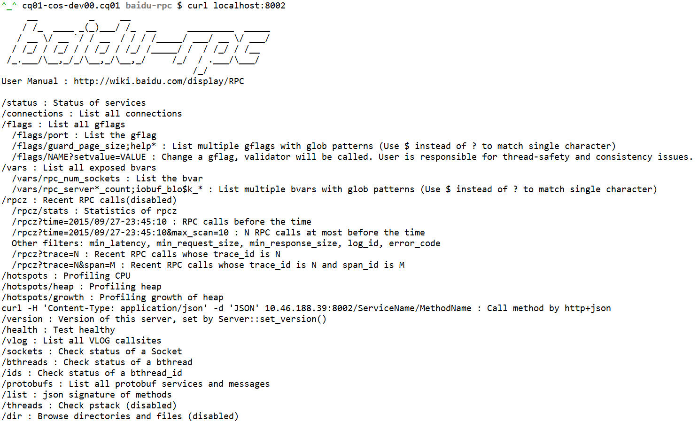
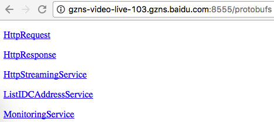
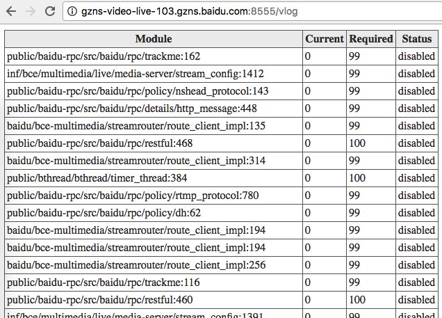

# About Builtin Services

Builtin services expose internal status of servers, making development and debugging more efficient over brpc. brpc serves builting services via `HTTP`, which can be easily accessed through curl and browsers.  Servers respond *plain text* or *html* according to `User-Agent` in the request header, or you can append `?console=1` to the *uri* which forces servers to respond *plain text*. Here's an [example](http://brpc.baidu.com:8765/) running on our machine, check it out for more information about the builtin services. If the listen port is filtered(e.g. only ports in *8000-8999* can be accessed outside data centers in Baidu), you can run [rpc_view](rpc_view.md) to launch a proxy or run `curl \<SERVER-URL\>` inside data centers.

Accessed through browsers:

Accessed through terminal:

# Safe Mode

To stay safe from attack, you **must** disable builtin services in the servers on public network, including the ones accessed by proxies(nginx or other http servers). Click [here](server.md#安全模式) for more details.

# Main services:

[status](status.md)

[vars](vars.md)

[connections](connections.md)

[flags](flags.md)

[rpcz](rpcz.md)

[cpu profiler](cpu_profiler.md)

[heap profiler](heap_profiler.md)

[contention profiler](contention_profiler.md)

# Other services

[version service](http://brpc.baidu.com:8765/version) shows the version of the server。Invoke Server::set_version() to specify version of your server, or brpc would generate a default version in like `brpc_server_<service-name1>_<service-name2> ...`

[health service](http://brpc.baidu.com:8765/health) shows whether this server is alive or not.

[protobufs service](http://brpc.baidu.com:8765/protobufs) shows scheme of all the protobuf messages insides the server.

[vlog service](http://brpc.baidu.com:8765/vlog) shows all the [VLOG](streaming_log.md#VLOG) that can be enable(not work with glog).

