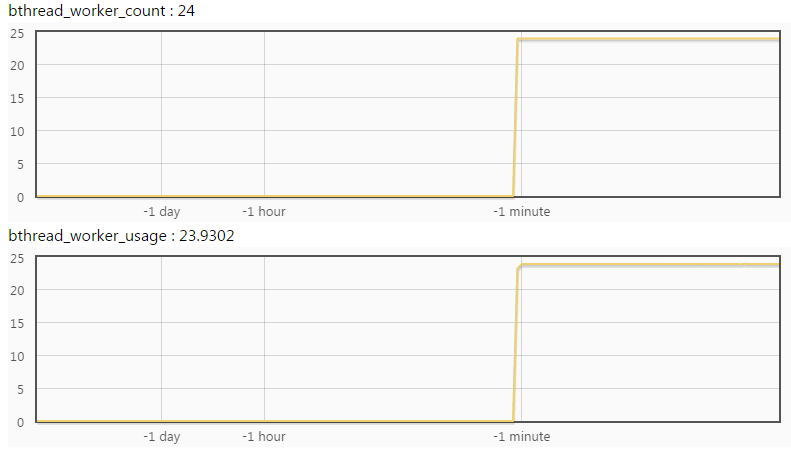
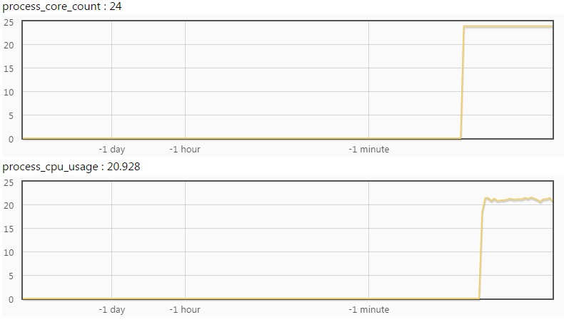
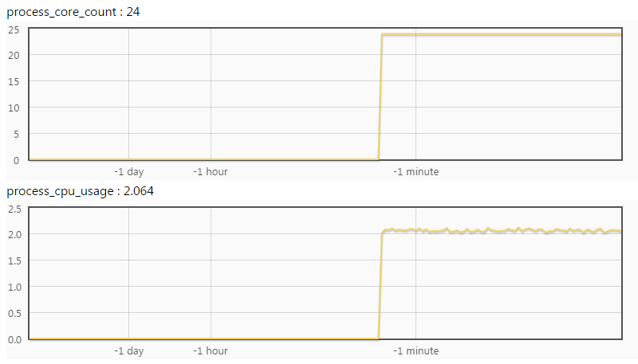
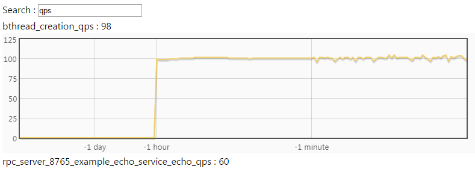

# 1. Check the number of worker threads

Check /vars/bthread_worker_**count** and /vars/bthread_worker_**usage**, which is the number of worker threads in total and being used, respectively.

> The number of usage and count being close means that worker threads are not enough.

For example, there are 24 worker threads in the following figure, among which 23.93 worker threads are being used, indicating all the worker threads are full of jobs and not enough.



There are 2.36 worker threads being used in the following figure. Apparently the worker threads are enough.


These two figures can be seen directly by putting /vars/bthread_worker_count;bthread_worker_usage?expand after service url, just like [this](http://brpc.baidu.com:8765/vars/bthread_worker_count;bthread_worker_usage?expand).

# 2. Check CPU usage

Check /vars/system_core_**count** and /vars/process_cpu_**usage**, which is the number of cpu core available and being used, respectively.

> The number of usage and count being close means that cpus are enough.

In the following figure the number of cores is 24, while the number of cores being used is 20.9, which means CPU is bottleneck.



The number of cores being used in the figure below is 2.06, then CPU is sufficient.



# 3. Locate problems

The number of process_cpu_usage being close to bthread_worker_usage means it is a cpu-bound program and worker threads are doing calculations in most of the time.

The number of process_cpu_usage being much less than bthread_worker_usage means it is an io-bound program and worker threads are blocking in most of the time.

(1 - process_cpu_usage / bthread_worker_usage) is the time ratio that spent on blocking. For example, if process_cpu_usage = 2.4, bthread_worker_usage = 18.5, then worker threads spent 87.1% of time on blocking.

## 3.1 Locate cpu-bound problem

The possible reason may be the poor performance of single server or uneven distribution to upstreams.

### exclude the suspect of uneven distribution to upstreams

Enter qps at [vars]((http://brpc.baidu.com:8765/vars) page of different services to check whether qps is as expected, just like this:



Or directly visit using curl in command line, like this:

```shell
$ curl brpc.baidu.com:8765/vars/*qps*
bthread_creation_qps : 95
rpc_server_8765_example_echo_service_echo_qps : 57
```

If the distribution of different machines is indeed uneven and difficult to solve, [Limit concurrency](server.md#user-content-limit-concurrency) can be considered to use.

### Improve performance of single server

Please use [CPU profiler](cpu_profiler.md) to analyze hot spots of the program and use data to guide optimization. Generally speaking, some big and obvious hot spots can be found in a cpu-bound program.

## 3.2 Locate io-bound problem

The possible reason:

- working threads are not enough.
- the client that visits downstream servers doesn't support bthread and the latency is too long.
- blocking that caused by internal locks, IO, etc.

If blocking is inevitable, please consider asynchronous method.


