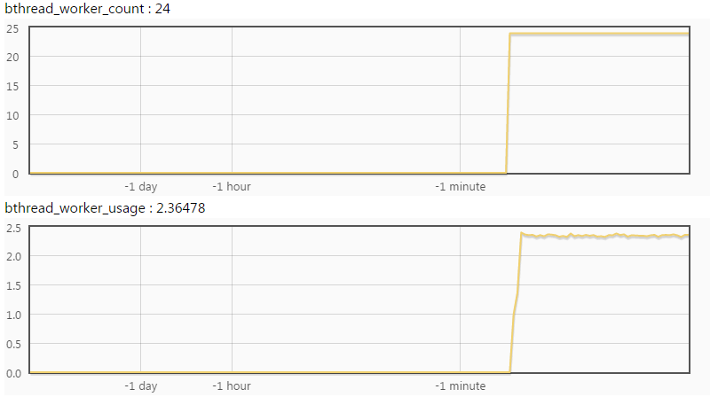

# 1. Check the number of worker threads

Check /vars/bthread_worker_**count** and /vars/bthread_worker_**usage**, which is the number of worker threads in all and the number of worer threads being used, respectively.

> The number of usage and count being close means that the worker threads are not enough.

For example, there are 24 worker threads in the following figure, among which 23.93 worker threads are being used, indicating all the worker threads are full of jobs and not enough.

There are 2.36 worker threads being used in the following figure. Apparently the worker threads are enough.

These two figures can be seen directly by putting /vars/bthread_worker_count;bthread_worker_usage?expand after service url, just like [this](http://brpc.baidu.com:8765/vars/bthread_worker_count;bthread_worker_usage?expand).

