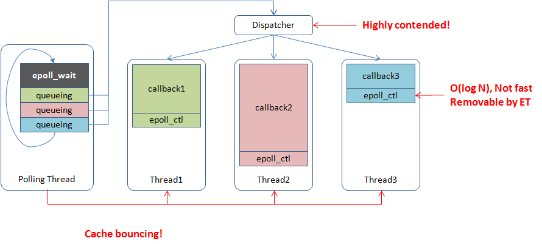

# Common thread model

## A connection corresponds to a thread or process

A thread/process handles all the messages from a fd and quits until the connection is closed. When the number of connections increases, the resources occupied by threads/processes and the cost of context switching will become increasingly large and cause poor performance, which is source of the [C10K](http://en.wikipedia.org/wiki/C10k_problem) problem. These two methods are common in early web servers and are rarely used today.

## Single-threaded reactor

The event-loop library such as [libevent](http://libevent.org/)[, ](http://en.wikipedia.org/wiki/Reactor_pattern)[libev](http://software.schmorp.de/pkg/libev.html) is a typical example. Usually a event dispatcher is responsible for waiting different kinds of event and calls event handler in situ after an event happens. After handler is processed, dispatcher waits more events, so called "loop". Essentially all handler functions are executed in the order of occurrence in one system thread. One event-loop can use only one core, so this kind of program is either IO-bound or has a short and fixed running time(such as http server). Otherwise one callback will block the whole program and causes high latencies. In practice this kind of program is not suitable for many people involved, because the performance may be significantly degraded if no enouth attentions are paid. The extensibility of the event-loop program depends on multiple processes.

The single-threaded reactor works as shown below:

## N:1 thread library

Generally, N user threads are mapped into a system thread (LWP), and only one user thread can be run, such as [GNU Pth](http://www.gnu.org/software/pth/pth-manual.html), [StateThreads](http://state-threads.sourceforge.net/index.html). When the blocking function is called, current user thread is yield. It also known as [Fiber](http://en.wikipedia.org/wiki/Fiber_(computer_science)). N:1 thread library is equal to single-threaded reactor. Event callback is replaced by an independent stack and registers, and running callbacks becomes jumping to the corresponding context. Since all the logic runs in a system thread, N:1 thread library does not produce complex race conditions, and some scenarios do not require a lock. Because only one core can be used just like event loop library, N:1 thread library cannot give full play to multi-core performance, only suitable for some specific scenarios. But it also to reduce the jump between different cores, coupled with giving up the independent signal mask, context switch can be done quickly(100 ~ 200ns). Generally, the performance of N:1 thread library is as good as event loop and its extensibility also depends on multiple processes.

## Multi-threaded reactr

Kylin, [boost::asio](http://www.boost.org/doc/libs/1_56_0/doc/html/boost_asio.html) is a typical example. Generally event dispatcher is run by one or several threads and schedules event handler to a worker thread to run after event happens. Since SMP machines are widely used in Baidu, the structure using multiple cores like this is more suitable and the method of exchanging messages between threads is simpler than that between processes, so it often makes multi-core load more uniform. However, due to cache coherence restrictions, the multi-threaded reactor model does not achieve linearity in the scalability of the core. In a particular scenario, the rough multi-threaded reactor running on a 24-core machine is not even faster than a single-threaded reactor with a dedicated implementation. Reactor has a proactor variant, namely using asynchronous IO to replace event dispatcher. Boost::asio is a proactor under [Windows](http://msdn.microsoft.com/en-us/library/aa365198(VS.85).aspx).

The multi-threaded reactor works2 as shown blew:

# What else can we improve?

## Extensibility is not good enough

Ideally, it is best for user to write event-driven code, but in reality because of the problem of the difficulty of coding and maintainability, the using way of users is mostly mixed: synchronous IO is often issued in callbacks so that worker thread is blocked and it cannot process other requests. A request often goes through dozens of services, which means that a thread spent a lot of time waiting for responses from downstreams. Users often have to lauch hundreds of threads to maintain high throughput, which resulted in high-intensity scheduling overhead. What's more, for simplicity, mutex and condition using global contention is often used to distributing tasks. When all threads are in a highly-contented state, the efficiency is clearly not high. A better approach is to use more task queues and corresponding scheduling algorithms to reduce global contention.

## Asynchronous programming is difficult

The process control in asynchronous programming are full of traps even for the experts. 

