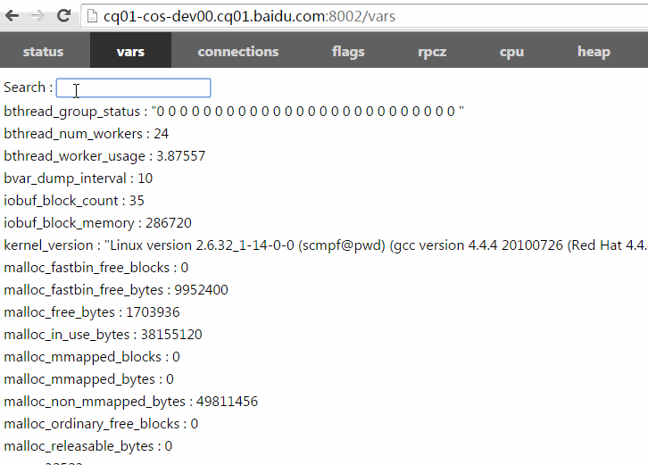
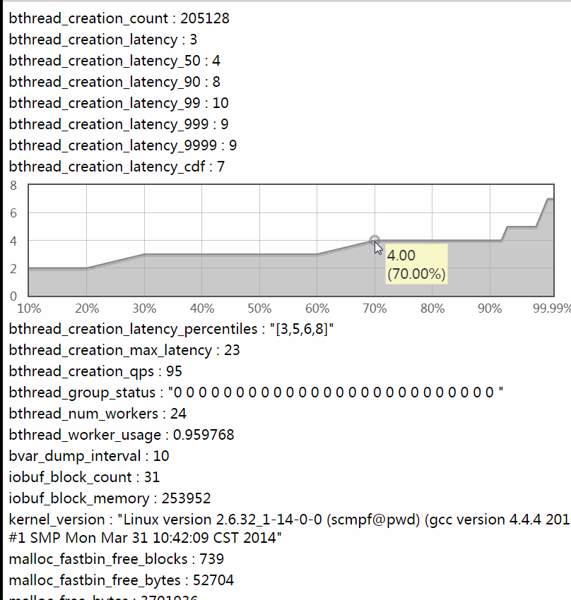
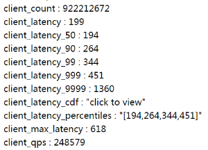

[bvar](https://github.com/brpc/brpc/tree/master/src/bvar/) is a counting utility designed for multiple threaded applications. It stores data in thread local storage(TLS) to avoid costly cache bouncing caused by concurrent modification. It is much faster than UbMonitor(a legacy counting utility used inside Baidu) and atomic operation in highly contended scenarios. bvar is builtin within brpc, through [/vars](http://brpc.baidu.com:8765/vars) you can access all the exposed bvars inside the server, or a single one specified by [/vars/`VARNAME`](http://brpc.baidu.com:8765/vars/rpc_socket_count). Check out [bvar](../cn/bvar.md) if you'd like add some bvars for you own services. bvar is widely used inside brpc to calculate indicators to show internal status. It is **almost free** in most scenarios to collect data.  If you are looking for a utility to collect and show internal status of your application, try bvar at the first time. However bvar is not suitable for general purpose counters, the read process of a single bvar have to combines all the TLS data from the threads that the very bvar has been written, which is very slow compared to the write process and atomic operations.

## Check out bvars

[/vars](http://brpc.baidu.com:8765/vars) : List all the bvars

[/vars/NAME](http://brpc.baidu.com:8765/vars/rpc_socket_count)：Check out the bvar whose name is `NAME`

[/vars/NAME1,NAME2,NAME3](http://brpc.baidu.com:8765/vars/pid;process_cpu_usage;rpc_controller_count)：Check out the bvars whose name are `NAME1`, `NAME2` or `NAME3`.

[/vars/foo*,b$r](http://brpc.baidu.com:8765/vars/rpc_server*_count;iobuf_blo$k_*) Check out for the bvar whose name matches the given pattern. Note that `$` replaces `?` to represent a single character since `?` is reserved in URL.

The following animation shows how you can check out bvars with pattern. You can paste the URI to other forks who will see excatcly the same contents through this URI.


There's also a search box in front of /vars page. You can check out bvars with parts of the names. Different names can be specareted by `,` `:` or ` `.



It's OK to access /vars throught terminal with curl as well：

```
$ curl brpc.baidu.com:8765/vars/bthread*
bthread_creation_count : 125134
bthread_creation_latency : 3
bthread_creation_latency_50 : 3
bthread_creation_latency_90 : 5
bthread_creation_latency_99 : 7
bthread_creation_latency_999 : 12
bthread_creation_latency_9999 : 12
bthread_creation_latency_cdf : "click to view"
bthread_creation_latency_percentiles : "[3,5,7,12]"
bthread_creation_max_latency : 7
bthread_creation_qps : 100
bthread_group_status : "0 0 0 0 0 0 0 0 0 0 0 0 0 0 0 0 0 0 0 0 0 0 0 0 0 0 "
bthread_num_workers : 24
bthread_worker_usage : 1.01056
```

## Check out timing diagrams.

You can click most of numerical bvar to check out the timing diagram. Every clickable bvar store values in the recent `60s/60m/24h/30d`, *174* numbers in total。It takes about 1M memory when there are 1000 clickable bvars.



## Calculate and check out percentiles

A percentile indicats the value below a given percentage of samples in a group of samples. E.g. there are 1000 in a very time window，The 500-th in the sorted set(1000 * 50%) is the value 50%-percentile(says median),  the number at the 990-th is 99%-percentile(1000 * 99%)，the number at 999-th is 99.9%-percentile. Percentiles shows more formation about the latency distribution than average latency, which is very important for you are calculating the SAL of the service. The 99.9% percentile of latency limits the usage of the service rather than the average latency.

Percentiles can be plotted as a CDF curve or a timing diagram.


The diagram above is a CDF curve. The vertical axis is the value of latency and the horizontal axis is the percentage of value less than the one at vertical axis. Obviously, this diagram is plotted by percentiles from 10% to 99.99%。 For example, the vertical axis value corresponding to the horizontal axis at 50% is 50%-percentile of the quantile value. CDF is short for [Cumulative Distribution Function](https://en.wikipedia.org/wiki/Cumulative_distribution_function).  When we choose a vertical axis value `x`, the corresponding horizontal axis means "the ratio of the value <= `x`".  If the numbers are randomly sampled, it stands for "*the probability* of value <= `x`”, which is exacly the definition of distribution.  The derivative of the CDF is a [PDF(probability density function)](https://en.wikipedia.org/wiki/Probability_density_function). In other words, if we divide the vertical axis of the CDF into a number of small segments, calculating the difference between the corresponding values at the at both ends and use the difference as a new horizontal axis, it would draw the PDF curve, just as the *(horizontal) normal distribution* or *Poisson distribution*. The density of median will be significantly higher than the long tail in PDF curve. However we care more about the long tail. As a result, most system tests shows CDF curve rather than PDF curve.

Some simple rules to judge if it is a *good* CDF curve

- The flatter the better. It's the best that the CDF curve is just a horizontal line which indicates that there's  no waiting, congestion nor pausing. Of course it's impossible practically.
- The more narrow after 99% the better, which shows the range of long tail. And it's a very important part in the SLA of most system. For example, if a indicator of a storage system is "99.9% of read should finish in *xx milliseconds*"), the maintainer cares about the value at 99.9%; If a indicater of a search system is "99.99% of requests should finish in *xx milliseconds*), you should care about the value at 99.99%.

It is a good CDF curve if the gradient is small and the tail is narrow.


It's a timing diagram of percentiles above, which consists of four curves. The horizontal axis is the time and the vertical axis of the curves from top to bottom is the latency at 99.9%/99%/90%/50%-percentiles. The color from top to bottom is also more and more shallow (from orange to yellow). You can slide the mouse on the curve to read the corresponding data at different time. The number shows above means "The `99%`-percentile of latency before `39` seconds is `330` microseconds". The curve of 99.99% percentile is not show  in this diagram since it's significantly higher than the others, which makes the other four curves hard to tell. You can click the bvars whose names end with "*_latency_9999*" to check the 99.99%-percentile along, and you can also check out curves of 50%,90%,99%,99.9% percentiles along in the same ways. The timing digram shows the trends of percentiles,  which is very helpful when you are analyzing the performance of the system.

brpc calculates latency distributed of the services. Users don't need to do this by themselves. The result is like the following piecture.


Use `bvar::LatencyRecorder` to calculate the latency distribution of non rpc services in the ways shows in teh following code block. (checkout [bvar-c++](bvar_c++.md) for more details):

```c++
#include <bvar/bvar.h>
 
...
bvar::LatencyRecorder g_latency_recorder("client");  // expose this recorder
... 
void foo() {
    ...
    g_latency_recorder << my_latency;
    ...
}
```

If there's already a rpc server started in the application, you can view the value like `client_latency, client_latency_cdf` through `/vars`. Click them and you view dynamic curves, like the folowing picture.



## Non brpc server

If there's only clients of brpc used in the application or you don't even use brpc. Check out [this page](../cn/dummy_server.md) if you'd like check out the curves as well.
